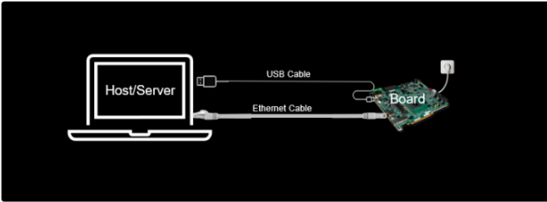
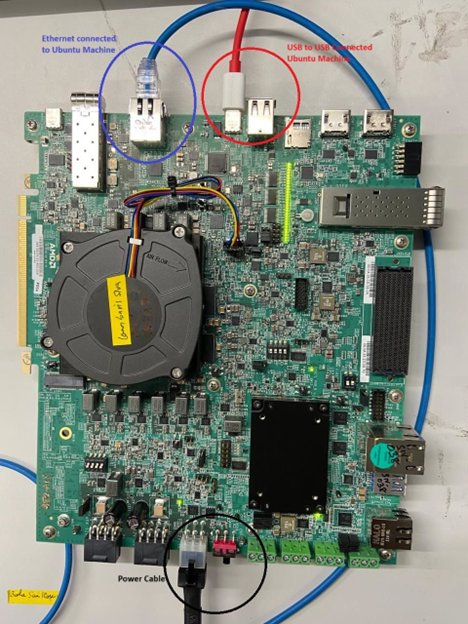
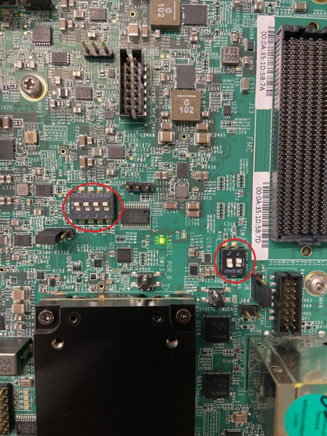

Board Setup
===========

This setup uses JTAG to flash images onto the board and UART to access the Linux console running on the board for application execution. The board’s Ethernet port connects directly to an Ubuntu host machine, which serves as the server for flashing images via JTAG. This Ethernet connection is essential for transferring images and mounting the working directory on the board’s Linux system to facilitate application execution. The VEK385 board includes an integrated JTAG and UART-to-USB interface.

If you boot from OSPI or an SD card, follow the setup steps below up to the section on configuring the TFTP server. Skip the sections on configuring the NFS server and booting the board. For detailed instructions on OSPI or SD card boot, see :doc:`board_setup_ospi_sd`.

The following images illustrate how the connections are established between the board and the Ubuntu machine.

Switch Settings for JTAG Mode
-----------------------------

The following image depicts the switch settings required for operating the board in JTAG mode.

Release Packages
----------------

Please download the following files:

1. `vitis_ai_2025.1_web_vek385.tar <https://account.amd.com/en/forms/downloads/eula-xef.html?filename=vitis_ai_2025.1_web_vek385.tar>`__
2. `vitis_ai_2ve_2025.1_web_docker.tgz <https://account.amd.com/en/forms/downloads/eula-xef.html?filename=vitis_ai_2ve_2025.1_web_docker.tgz>`__
3. `resnet18_bf16_aiemlv2_Jun.zip <https://account.amd.com/en/forms/downloads/amd-end-user-license-xef.html?filename=resnet18_bf16_aiemlv2_Jun.zip>`__

vitis_ai_2025.1_web_vek385.tar
~~~~~~~~~~~~~~~~~~~~~~~~~~~~~~

This package contains the ResNet50 model python application and boot images; it should be extracted in the /home/ directory of Host. While users can extract it to any preferred path, they must ensure the relevant commands are updated accordingly.

.. code-block:: bash

   sudo tar -xvf vitis_ai_2025.1_web_vek385.tar -C /home
   sudo tar -xvf /home/amd/vaiml_models.tar  -C /home/amd/
   cd /home

Directory Structure
+++++++++++++++++++

For the purpose of this document, it is assumed that the release package is extracted in ``/home/amd/``. The following directory structure represents the contents:

.. code-block:: text

   /home/
   ├── amd
   |    ├── boot_images
   |    ├── sdk_installer.tar
   |    └── vaiml_models.tar
   ├── amd-end-user-license-agreement.pdf
   └── Vitis_AI_Telluride_2025.1_web_third_party_notices.pdf

vitis_ai_2ve_2025.1_web_docker.tgz
~~~~~~~~~~~~~~~~~~~~~~~~~~~~~~~~~~

This is a Docker image used to compile models. Copy the Docker image onto the Host machine. Refer to :doc:`docker-setup` to setup docker.

AMD End User License Agreement
------------------------------

Refer to following licensing files available at ``/home/`` directory and review the terms and conditions to use the package.

- amd-end-user-license-agreement.pdf
- Vitis_AI_Telluride_2025.1_web_third_party_notices.pdf

Host Setup
----------

Install Vivado
~~~~~~~~~~~~~~

Install Vivado 2025.1 by following the instructions in `UG973 <https://docs.amd.com/r/en-US/ug973-vivado-release-notes-install-license/Download-and-Installation>`_.

Install Cable Driver
~~~~~~~~~~~~~~~~~~~~

The cable driver is included in the Vivado installer and is essential for enabling JTAG and serial connections to the board via USB.

To install the driver, execute the following commands on your Host as root:

.. code-block:: bash

   cd ${vivado_install_dir}/2025.1/data/xicom/cable_drivers/lin64/install_script/install_drivers/
   sudo ./install_drivers

Note: Replace ``${vivado_install_dir}`` with the location of your installation directory.

Configure a Static IP for a Linux Host Machine
~~~~~~~~~~~~~~~~~~~~~~~~~~~~~~~~~~~~~~~~~~~~~~

This guide will walk you through the process of copying Linux images to your board using TFTP, as well as mounting the application on the Linux system running on the board via NFS. To successfully complete this setup, you need to configure your Host machine as both a TFTP and NFS server.

Establishing a static IP address for your Linux Host will ensure communication with the board on the same network. Assign a static IP address to the Host ethernet interface connected to the board and execute the following commands on the host:

.. code-block:: bash

   cd ${vivado_install_dir}/2025.1/data/xicom/cable_drivers/lin64/install_script/install_drivers/
   sudo ./install_drivers
   sudo ifconfig <interface-name> <IP-address> netmask <subnet-mask>
   #### Example: enxc8a362a6a5be is the interface connected to the board
   sudo ifconfig enxc8a362a6a5be 10.10.70.101 netmask 255.255.255.0

Install DHCP Server on Host
~~~~~~~~~~~~~~~~~~~~~~~~~~~

This service handles dynamic IP allocation for the board in the configured subnet. Execute the following command on the Host:

.. code-block:: bash

   sudo apt install isc-dhcp-server

Configure DHCP Server
~~~~~~~~~~~~~~~~~~~~~

1. Update ``/etc/dhcp/dhcpd.conf`` to define the range of IP addresses, router, and DNS servers for the board:

   .. code-block:: text

      default-lease-time 600;
      max-lease-time 7200;
      authoritative;
      subnet 10.10.70.0  netmask 255.255.255.0 {
         range 10.10.70.1  10.10.70.5;
         option routers 10.10.70.101;
         option domain-name-servers 8.8.8.8, 8.8.4.4;
      }

2. Identify the active interface:

   .. code-block:: bash

      ip link show

3. Update the network interface in ``/etc/default/isc-dhcp-server``:

   .. code-block:: text

      INTERFACESv4="<interface-name>"
      INTERFACESv6="<interface-name>"
      # Example
      INTERFACESv4="enxc8a362a6a5be"
      INTERFACESv6="enxc8a362a6a5be"

4. Restart and check the DHCP service:

   .. code-block:: bash

      sudo systemctl restart isc-dhcp-server
      sudo systemctl status isc-dhcp-server

Configure TFTP Server
~~~~~~~~~~~~~~~~~~~~~

This service is used to transfer Linux images to the board from the Host. The path is set to ``/home/amd`` because this is where the release package is extracted. Execute the following commands on Host.

Note: Skip this section if TFTP is already installed.

1. Ensure no service is using UDP port 69:

   .. code-block:: bash

      sudo netstat -tuln | grep :69

2. Install TFTP-HPA:

   .. code-block:: bash

      sudo apt install tftpd-hpa

3. Edit TFTP-HPA settings in ``/etc/default/tftpd-hpa``:

   .. code-block:: text

      TFTP_USERNAME="tftp"
      TFTP_DIRECTORY="/home/amd/boot_images/"
      TFTP_ADDRESS="10.10.70.101:69"
      TFTP_OPTIONS="--secure"

4. Set up the TFTP directory:

   .. code-block:: bash

      sudo useradd -r -s /bin/false tftp
      sudo chown -R tftp:tftp /home/amd/boot_images/

5. Enable and start the TFTP service:

   .. code-block:: bash

      sudo systemctl enable tftpd-hpa
      sudo systemctl start tftpd-hpa
      sudo systemctl status tftpd-hpa

Configure NFS Server
~~~~~~~~~~~~~~~~~~~~

Enable this service only if the root filesystem (RootFS) is served over NFS. If you boot from OSPI or an SD card, this step is optional. Skip this section if NFS is already installed. For details on OSPI or SD card boot, see :doc:`board_setup_ospi_sd`.

1. Install the NFS server package:

   .. code-block:: bash

      sudo apt-get install nfs-kernel-server

2. Update ``/etc/exports`` with the shared directory and network access:

   .. code-block:: text

      /home/amd/vaiml_models 10.10.0.0/255.255.0.0(rw,sync,no_subtree_check,no_root_squash)

3. Export the file system:

   .. code-block:: bash

      sudo exportfs -a

4. Start and enable the NFS service:

   .. code-block:: bash

      sudo systemctl start nfs-kernel-server
      sudo systemctl enable nfs-kernel-server

Booting the Board
------------------

1. On your Host, open Minicom on ``/dev/ttyUSB1`` with settings 115200, 8N1.

   .. code-block:: bash

      minicom -D /dev/ttyUSB1

2. In another Host terminal, open JTAG (XSDB):

   .. code-block:: bash

      export PATH=${vivado_install_dir}/2025.1/Vivado/bin/:$PATH
      export LD_LIBRARY_PATH=${vivado_install_dir}/2025.1/Vivado/lib/:$LD_LIBRARY_PATH
      xsdb

   .. note::

      Replace ``${vivado_install_dir}`` with the actual path of your installation directory.

3. At the XSDB prompt, enter the following commands:

   .. code-block:: bash

      cd /home/amd/boot_images/
      connect
      source load_vek385_img.tcl

   .. note::

      Immediately after executing the command at the XSDB prompt, switch to the Minicom terminal and press Enter as the logs start to appear on the Minicom prompt. The script flashes the PDI and U-Boot images onto the board, a process that typically takes around 30 seconds.

   .. note::

      If an error is encountered during boot, execute the following command in XSDB and repeat Step 3.

   .. code-block:: bash

      dev reset

4. After successfully loading U-Boot, type the following commands in the Minicom terminal to transfer the image from FTP:

   .. code-block:: bash

      dhcp
      tftpb 0x4000000 rootfs.cpio.gz.u-boot
      tftpb 0x80000 Image
      booti 0x80000 0x4000000 0x1000

5. After successful Linux boots mount the model directory on vek385 hw:

   .. code-block:: bash

      sudo mount -t nfs 10.10.70.101:/home/amd/vaiml_models/ /mnt
