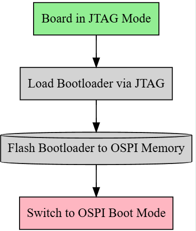
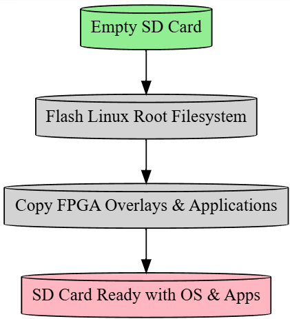
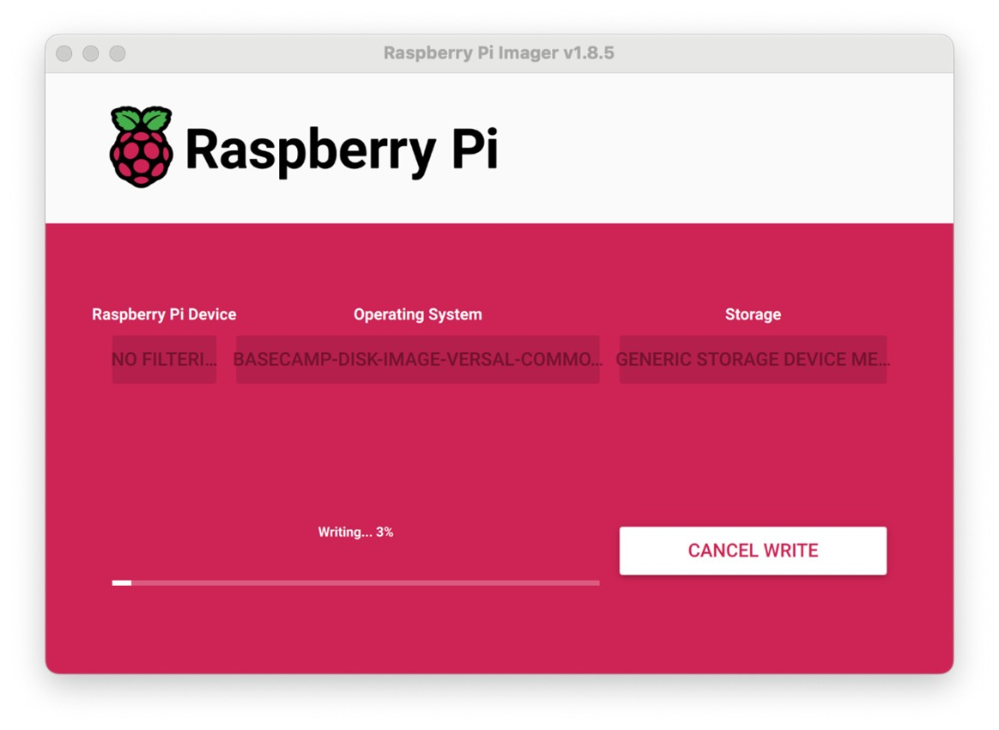
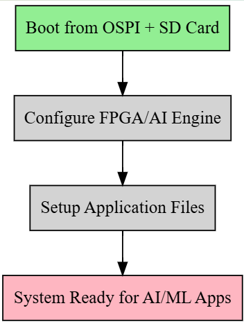

OSPI and SD Card Boot Flow
==========================

This setup introduces the boot flow using OSPI and SD card.

The configuration steps from :doc:`board_setup` still apply. However, when using OSPI and SD card boot modes, the NFS server install is optional. After completing the board setup as described in :doc:`board_setup`, skip the JTAG based boot steps and follow the instructions below.

There are three main sections in this flow:

- **Section 1 (Board Setup):** Uses JTAG to load and flash the bootloader into the board's OSPI memory, then switches the board to boot from OSPI instead of JTAG.

- **Section 2 (SD Card Setup):** Flashes the Linux root filesystem image onto an SD card and copies necessary application files and FPGA overlays to it.

- **Section 3 (Board Boot):** Boots the complete system from OSPI + SD card, then configures the FPGA/AI Engine with the required overlays and application files for AI/ML functionality.

Section 1: Board Setup 
----------------------

**Purpose: Initial Boot & OSPI Programming**

Step 1: Initial Board Configuration
~~~~~~~~~~~~~~~~~~~~~~~~~~~~~~~~~~~

- **Power OFF & JTAG Mode**: This step sets the board in JTAG boot mode so we can load firmware directly through JTAG debugger interface instead of from storage devices
Power OFF the board from Power Slider switch and set the SW1 DIP switch to JTAG boot mode:

+-------------------+-----------------+-------------------+
|  SW1 DIP Switch   | Mode Pins [0:3] | Mode SW1 [1:4]    |
+===================+=================+===================+
| SDCARD Boot (SD1) | 0111            | ON, OFF, OFF, OFF |
+-------------------+-----------------+-------------------+
| OSPI / QSPI Boot  | 0001            | ON, ON, ON, OFF   |
+-------------------+-----------------+-------------------+
| JTAG Boot         | 0000            | ON, ON, ON, ON    |
+-------------------+-----------------+-------------------+

Step 2: Terminal Setup
~~~~~~~~~~~~~~~~~~~~~~~

- **Minicom**: Opens serial console to monitor boot messages and interact with bootloader
- **XSDB**: Opens Xilinx debugger tool to communicate with the FPGA/SoC through JTAG

On your Host open minicom on /dev/ttyUSB1, with settings 115200, 8N1.

.. code-block::

	“minicom -D /dev/ttyUSB1” 
	or 
	“screen /dev/ttyUSB1 115200”

On another Host terminal, open JTAG (XSDB):

.. code-block::

	source <vivado_install_dir>/2025.1/Vitis/settings64.sh 
	xsdb

**Note:** Replace ${vivado_install_dir} with the actual path of your installation directory.

Step 3: XSDB Commands
~~~~~~~~~~~~~~~~~~~~~~

- **Connect & Load BOOT.bin**: This step downloads and executes the bootloader (PDI + U-Boot) directly into the board's memory via JTAG
- **30-second process**: Flashes the bootloader images to get the board running

At the XSDB prompt, enter the following commands:

.. code-block::

	cd /home/amd/boot_images/ 
	connect 
	set port 3121 
	target -set -filter {name =~ "xc2ve3858"} 
	dev p BOOT.bin

**Note:** Immediately after executing the command on the XSDB prompt, switch to the Minicom/screen terminal and press enter as the logs start to appear on the Minicom prompt. The script flashes the PDI and U-Boot images onto the board, a process that typically takes around 30 seconds. 

**Note:** If an error is encountered during boot, then execute the following command in xsdb and repeat Step 3.

.. code-block::

	dev reset

Step 4: U-Boot Commands
~~~~~~~~~~~~~~~~~~~~~~~~

- **DHCP**: Gets network configuration to download files
- **TFTP Download**: Downloads the OSPI image file from network server to memory

After successfully loading U-Boot, type the following commands in the Minicom terminal to transfer the OSPI Image from FTP and flash the root file system to the SD Card:

.. code-block::

	dhcp 
	setenv tftpblocksize 8192 
	tftpb 0x20000000 edf-ospi-versal2-vek385-sdt-full.bin 
	
Step 5: Flash OSPI
~~~~~~~~~~~~~~~~~~

- **sf probe/erase/write**: Programs the OSPI flash memory with the bootloader so the board can boot independently next time

.. code-block::

	sf probe 0 0 0 
	sf erase 0x0 0x10000000 
	sf write 0x20000000 0x0 0x10000000

Step 6: Switch to OSPI Boot Mode
~~~~~~~~~~~~~~~~~~~~~~~~~~~~~~~~

- **Change DIP switch**: Configures board to boot from the OSPI flash we just programmed instead of JTAG

Power off the board

  a. change the boot mode setting to OSPI boot by toggling SW1 DIP switch on the board

  b. OSPI / QSPI Boot 0001 ON, ON, ON, OFF

---

Section 2: SD Card Setup
-------------------------

**Purpose: Prepare Root Filesystem**

       

Step 1: Prepare SD Card
~~~~~~~~~~~~~~~~~~~~~~~

- **Remove & Connect**: Takes SD card to host computer for programming
- Remove the SD card from the target board and put it in an SD card reader
- Connect the SD card reader to the Ubuntu Host machine

Step 2: Flash Root Filesystem
~~~~~~~~~~~~~~~~~~~~~~~~~~~~~~

- **RPi Imager/bmaptool**: Writes the Linux root filesystem image to SD card
- **rootfs.wic.xz**: Contains the complete Linux operating system, applications, and file structure

Flash the rootfs.wic.xz on the SD card using either method:

**GUI Method:**
Open RPi Imager and configure:

.. code-block::

	sudo apt install rpi-imager 
	sudo rpi-imager

Raspberry Pi Device: Choose Device (None)

Operating System: /home/amd/boot_images/rootfs.wic.xz

Storage: SD Card

**CLI Method:**
Use bmaptool on host machine:

.. code-block::

	sudo apt install bmap-tools
	# Identify the SD card device path
	lsblk
	# NOTE: both rootfs.wic.xz and rootfs.wic.bmap should be in the same path
	sudo bmaptool copy rootfs.wic.xz /dev/sdc

Step 3: Copy Files and Resize
~~~~~~~~~~~~~~~~~~~~~~~~~~~~~

- **Copy overlays**: Adds FPGA configuration files and applications to the SD card
- **Resize partitions**: Expands filesystem to use full SD card capacity (if >8GB)

Copy the required overlays and applications into SD card

If using SD card > 8GB capacity, resize partitions to reclaim full storage space (see detailed resizing instructions below)

---

Section 3: Board Boot 
---------------------

- **Purpose: Final System Configuration**

Step 1: Boot the Board
~~~~~~~~~~~~~~~~~~~~~~~

- **OSPI Boot**: Board now boots from OSPI flash (bootloader) and SD card (filesystem)
- **Login**: Access the running Linux system

- 1.Power ON the board
- 2.Once the board boots successfully, login as the 'amd-edf' user

Step 2: Copy Overlays
~~~~~~~~~~~~~~~~~~~~~

- **Transfer files**: Gets FPGA configuration files and applications onto the running system

Copy the overlays and required applications from host to target using the SD card or NFS.

Step 3: Program PL + AIE Overlay
~~~~~~~~~~~~~~~~~~~~~~~~~~~~~~~~

- **fpgautil**: Configures the FPGA fabric (PL) and AI Engine (AIE) with specific functionality
- **Mandatory step**: Required before running AI/ML applications

Program PL + AIE overlay pdi and dtb:

 code-block::

	sudo fpgautil -b /overlay/vpl_gen_fixed_pld.pdi -o /overlay/pl_aiarm.dtbo

Note: This is a mandatory step to program the AIE overlays before running the XRT host application.

Use fpgautil -R -n full to remove the overlays and re-program them using the earlier fpgautil command.

Step 4: Copy Configuration Files
~~~~~~~~~~~~~~~~~~~~~~~~~~~~~~~~

- **Application configs**: Places configuration files where applications expect to find them
- **xclbin**: FPGA bitstream file for AI/ML acceleration

Copy the pre-processing cfg and xclbin into the required folder:

.. code-block::

	mkdir -p /run/media/mmcblk0p1/ 
	cp overlay/image_processing.cfg /run/media/mmcblk0p1/ 
	cp overlay/x_plus_ml.xclbin /run/media/mmcblk0p1/

This creates a complete embedded Linux system with FPGA acceleration capabilities.

---

Optional: SD Card Resizing 
--------------------------

**Purpose: Resizing the SD card partition to occupy full free space**

This is an **optional** step. User can alternatively use NFS to access the applications from host machines. After flashing the rootfs.wic.xz image to the SD card it occupies around 11GB of space. If you want to utilize the remaining free space, you can expand the storage partition using the following steps:

1. Unmount All SD Card Partitions

.. code-block::

	# List the SD card device
	lsblk

	# Umount by SD card device path as obtained above: sda, sdb or sdc, etc.
	sudo umount /dev/sdc2 
	sudo umount /dev/sdc3 
	sudo umount /dev/sdc4

If you get a "target is busy" error, make sure no applications or terminal windows are using files on the SD card.

2. Repartitioning with fdisk

.. code-block::

	#1. start fdisk
	sudo fdisk /dev/sdc

	#2. Print your current partition table and write down the number in the Start column:starting sector of /dev/sda4.
	Command (m for help): p

	#3. Delete the last VFAT partition (sdc4)
	Command (m for help): d
	Partition number (1-4, default 4): 4
	#4. Create a new partition:
	  •	Press n and Enter to create a new partition.
	  •	Partition number: Enter 4.
	  •	First sector: This is the most important step. Enter the exact starting sector you wrote down earlier for /dev/sdc4
	  •	Last sector: Press Enter to accept the default, which will use all the remaining free space on the card.
	  •	Do you want to remove the signature? No
	#5. Set the partition type to 0c (W95 FAT32 LBA):
	Command (m for help): t
	Partition number (1-4, default 4): 4
	Partition type or alias (type L to list all): 0c 
	#6. Review and write changes
	Command (m for help): w

3. Resize the Filesystem

.. code-block::

	#1. Tell the kernel to re-read the partition table
	sudo partprobe /dev/sdc

	#2. Reformat to ensure the filesystem uses the entire partition
	# Unmount if still mounted 
	sudo umount /dev/sdc4 
	# Format the partition as FAT32 
	sudo mkfs.vfat -F 32 /dev/sdc4

4. Verify the Result

The output should now show /dev/sdc3 with its new, expanded size.

.. code-block::

	lsblk /dev/sdc

5. Now user can insert the SD card back to the VEK385 board and switch the SW1 switch to OSPI Boot mode and Power ON the board

6. To make /dev/sda4 automount on your VEK385 board, you need to add an entry to the /etc/fstab file. This file tells the system which filesystems to mount and where to mount them at boot time.

.. code-block::

	sudo vim /etc/fstab

	# add the entry
	/dev/sda4    /storage    vfat    defaults,nofail    0    2

	# create storage directory
	sudo mkdir /storage

	# mount all filesystems
	sudo mount -a 

Your /dev/sda4 should now be mounted at /storage

