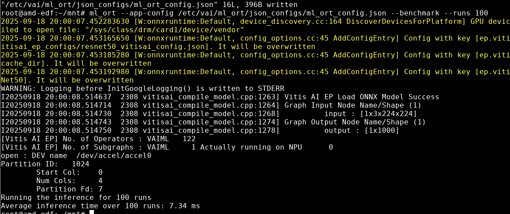

ML ORT
======

Overview
--------

This test application implements ONNX Runtime APIs and demonstrates their use with the Vitis AI Execution Provider.

The application takes IFMS in binary format and outputs OFMS in the outputs directory as <OFMName_DataType_TensorShape.bin>.

Instructions for building and running the application follow in the next sections.

Build Instructions
------------------

Prerequisites:

* sdk.sh to set cross tool-chain environment

Build steps:

1. Install sdk.sh provided as part of release in your x86 host machine.

2. Source the sysroot path:

.. code-block::

	unset LD_LIBRARY_PATH
	source <sysroot>/environment-setup-cortexa72-cortexa53-amd-linux

3. Navigate to *ml_ort* folder:

.. code-block::

	cd <sources>/examples/cpp_examples/ml_ort/

4. Build the application by executing the following command

.. code-block::

	make

5. Copy the application, json_configs and required files to the target board rootfs:

.. code-block::

	scp ml_ort <TARGET>:/usr/bin/
	scp -r json_configs <TARGET>:/etc/vai/ml_ort/

Usage
-----

.. code-block::

	ml_ort --app-config <config json file>

Arguments

* --app-config Application configuration (mandatory)

* --runs Run the model for n runs (optional)

* --benchmark Benchmark the model for n runs (optional)

* --help Print this help and exit

Default Behavior

* Benchmark is disabled by default.

* Number of runs (--runs) defaults to 1.

Note: Enabling the benchmark flag prevents the application from dumping outputs.

Input Format

* Accepts ifms in binary format.

Expected Output

* Dumps of OFMs in the outputs directory are in binary format, following the naming convention <OFMName_DataType_TensorShape.bin>.

Configuration JSON Guide for ml_ort
-----------------------------------

This document explains the structure and usage of the ml_ort_config.json file for configuring model inference runs.

The JSON file contains an object called inference-config, where each element describes the configuration for a single model inference session. Each session run requires the model file, input feature map (IFM) configuration, and execution provider options.

ml_ort_config.json example

.. code-block::

	{
	  "inference-config": {
	    "model-file": "resnet50_quantized_xint8.onnx",
	    "ifms-config": [
	      {
	        "name": "input",
	        "file": "/etc/vai/ml_ort/data/input_float32_1x3x224x224.bin"
	      }
	    ],
	    "execution-provider-options": {
	      "config_file": "vitisai_config.json",
	      "target" : "VAIML",
	      "cache_dir": "my_cache_dir",
	      "cache_key": "resnet50_quantized_xint8"
	    }
	  }
	}

Let us consider another JSON example of a matrix multiplication model that accepts two input feature maps (IFMs). You can see the difference in the IFMs configuration for the multi-input use case. The input names of the ONNX model are input0 and input1.

Note: The MatMul.onnx model is not available. We are explaining this to demonstrate multiple objects in the IFMs configuration.

MatMul example:

.. code-block::

	{
	  "inference-config": [
	    {
	      "model-file": "MatMul.onnx",
	      "ifms-config": [
	        {
	          "name": "input0",
	          "file": "input0_float32_2x3.bin"
	        },
	        {
	          "name": "input1",
	          "file": "input1_float32_3x4.bin"
	        }
	      ],
	      "execution-provider-options": {
	        "config_file": "vitisai_config.json",
	        "target" : "VAIML",
	        "cache_dir": "my_cache_dir",
	        "cache_key": "MatMul"
	      }
	    }
	  ]
	}

Description of *inference-config* Object

*inference-config* holds the model related information.

+----------------------------+------------------+----------------------------------------------------------------------+----------------+
|  Field                     | Type             | Description                                                          |  Example Value |
+============================+==================+======================================================================+================+
| model-file                 | String           | Path to the ONNX model file to be used for inference.                | "MatMul.onnx"  |
+----------------------------+------------------+----------------------------------------------------------------------+----------------+
| ifms-file                  | Array of Objects | List of input feature maps (IFMs) info required by the model-file.   | See Below      |
+----------------------------+------------------+----------------------------------------------------------------------+----------------+
| execution-provider-options | Object           | Options for the Vitis AI execution provider used during compilation. | See Below      |
+----------------------------+------------------+----------------------------------------------------------------------+----------------+

Description of *ifms-config* Array

*ifms-config* is an array that contains information about the input tensors for the specified model file.

+----------------------------+------------------+----------------------------------------------------------------------+----------------+
|  Field                     | Type             | Description                                                          |  Example Value |
+============================+==================+======================================================================+================+
| name                       | String           |  Input tensor name of the onnx model.  Get the names of a model      | "input_name"   |
|                            |                  |  by utilizing common/utils/get_onnx_in_out.py script.                |                |
+----------------------------+------------------+----------------------------------------------------------------------+----------------+
| file                       | String           |  Path to input data file                                             | "file_path.bin"|
+----------------------------+------------------+----------------------------------------------------------------------+----------------+

Description of *execution-provider-options* Object

*execution-provider-options* contains the options that were used during the compilation of the model. Please refer to ug1703_ve2 for more info on execution provider options.

+----------------------------+------------------+----------------------------------------------------------------------+------------------------+
|  Field                     | Type             | Description                                                          |  Example Value         |
+============================+==================+======================================================================+========================+
| config_file                | String           | Path to provider config file                                         | "vitisai_config.json"  |
+----------------------------+------------------+----------------------------------------------------------------------+------------------------+
| target                     | String           | Target hardware platform for VitisAI execution provider              | "VAIML"                |
+----------------------------+------------------+----------------------------------------------------------------------+------------------------+
| cache_dir                  | String           | The path and name of the cache directory.                            | "my_cache_dir"         |
+----------------------------+------------------+----------------------------------------------------------------------+------------------------+
| cache_key                  | String           | The subfolder in the cache directory where the compiled model is     | "MatMul"               |
|                            |                  | stored.                                                              |                        |
+----------------------------+------------------+----------------------------------------------------------------------+------------------------+

**Note:** Update the app-config JSON file according to your model. Ensure execution-provider-options match those used for model compilation.

Example commands
----------------

* Run with default options:

.. code-block::

        ml_ort --app-config /etc/vai/ml_ort/json_configs/ml_ort_config.json

* Benchmark the model for 100 runs:

.. code-block::

        ml_ort --app-config /etc/vai/ml_ort/json_configs/ml_ort_config.json --benchmark --runs 100

Results:

