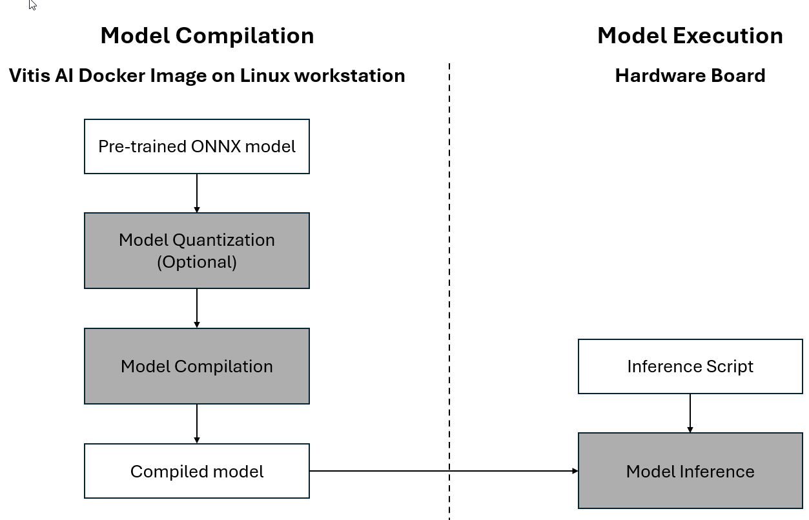

Development Flow Overview
=========================

The Vitis AI flow supports models saved in the ONNX format and uses ONNX Runtime as the primary mechanism to load, compile, and run models.

.. note::

   Models with ONNX opset 17 are recommended. If your model uses a different opset version, consider converting it using the ONNX Version Converter.

As shown in the diagram, the Vitis AI flow consists of three phases:

- **Model Quantization (For INT8 only)**
- **Model Compilation**
- **Model Execution**

You perform the model compilation phase on a Linux workstation using the tools included in the Vitis AI Docker image. The input to this phase is a pre-trained ONNX model. You can optionally quantize this model to INT8 or BF16 using AMD Quark, a comprehensive cross-platform deep learning toolkit designed to simplify and enhance the quantization of deep learning models. The model is then compiled by initializing an ONNX Runtime inference session with the Vitis AI Execution Provider, which analyzes the model, determines the subgraphs to run on the NPU, compiles them, and generates the necessary binary files.

.. note::

   During model compilation, FP32 models are automatically converted to BF16. If you want to use INT8 instead, you must use the Vitis AI 2025.1_web release and you must first quantize the model with Quark and then compile it.

The model execution is performed on the target hardware board. You copy the compiled model to the board's Linux filesystem, and it is deployed via an ONNX Runtime inference session with the Vitis AI Execution Provider.

The following sections of this guide provide detailed information about both phases.
