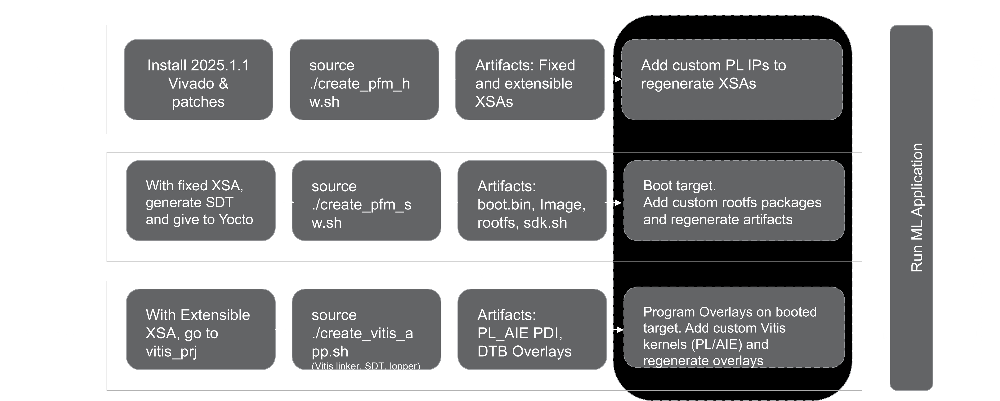

========================
Build a Reference Design
========================

This section explains how to build the reference design from source code on your host machine.

Reference Design Build flow
---------------------------

Prerequisites
-----------------------
Before starting, ensure you have:

- A valid Vivado/Vitis/AIE Compiler license
- The XILINXD_LICENSE_FILE environment variable set to your license file path

Setup Environment
-----------------------

Navigate to the platform directory:

.. code-block::

	cd <sources_path>/examples/reference_design/vek385/vitis_platforms/vaiml_platform/

Set license file (if not already configured):

.. code-block::

	# run this only if XILINXD_LICENSE_FILE is not set
	export XILINXD_LICENSE_FILE=<path_to_aie_license_file>

Source Vitis tools:

.. code-block::

	source <vivado_install_dir>/2025.1.1/Vitis/settings64.sh

Install SYSROOT
-----------------------

If the sysroot is not already installed, follow these steps:

.. code-block::

	# Copy SDK installer to temporary location
	cp /home/amd/boot_images/sdk.sh /tmp

	# Make installer executable
	chmod +x /tmp/sdk.sh

	# Clear library path to avoid conflicts
	unset LD_LIBRARY_PATH

	# Install SDK to specified path
	/tmp/sdk.sh -y -d <SYSROOT_PATH>

	# Set sysroot environment variable
	export SYSROOT=<SYSROOT_PATH>/sysroots/cortexa72-cortexa53-amd-linux

Building Vitis Platform
-----------------------

Follow these steps to generate the extensible Vitis platform and fixed XSA for Vitis application integration and software artifacts generation.

1. Tool Setup

	* Install: AMD Vivado/Vitis tools version 2025.1.1. Refer to `VIVADO 2025.1 Installation requirements <https://docs.amd.com/r/en-US/ug973-vivado-release-notes-install-license/Requirements-and-Setup>`_.

	* Define `XILINX_PATH` to point to the installed toolchain.

2. Run the following script to create Hardware Platform:

	.. code-block::

		source ./create_pfm_hw.sh

	This script performs the following:

	* Creates the Vivado design.

	* Runs synthesis and implementation.

	* Generates hardware artifacts in the hw folder.

3. Generated Artifacts

	* Fixed XSA:

    * Contains boot.pdi.

    * Used by Yocto to generate:

        * BOOT.BIN

        * Other software artifacts.

	* Extensible XSA:

		* Includes platform ports.

		* Used by Vitis tools to add custom kernels.

Building Software Components Using Yocto
----------------------------------------

This section outlines the process of generating software artifacts using the Yocto build system, based on the Fixed XSA generated during the Vitis platform creation.

1. Environment Setup

	* Install Yocto prequisites

		* The Reference Design Source Compilation utilizes Yocto sources and depends on specific applications. Please refer to the requirements documentation for detailed dependencies in `system-requirements <https://docs.yoctoproject.org/scarthgap/ref-manual/system-requirements.html>`_

		* Ubuntu 22.04.5 LTS – A Linux-based operating system for use as a server/host.

		* We need to install the following mandatory dependent packages which are required for Yocto build:

	.. code-block::

		sudo apt install curl build-essential chrpath cpio debianutils diffstat file gawk gcc git iputils-ping libacl1 liblz4-tool locales python3 python3-git python3-jinja2 python3-pexpect python3-pip python3-subunit socat texinfo unzip wget xz-utils zstd

	* Set locale for Yocto

	.. code-block::

		export LC_ALL=en_US.UTF-8
		export LANG=en_US.UTF-8

	* Update user git configuration information with sample commands as below.

	.. code-block::

		git config --global user.email "user@example.com"
		git config --global user.name "User Name"

	.. note::
		Replace “user@example.com” and “User Name” with user details

2. Run Yocto Build Script

	Execute:

	.. code-block::

		source ./create_pfm_sw.sh

	This script takes the hardware file *hw/example_design_pfm_fixed.xsa* as input.

3. Generated Artifacts

	* System Device Tree (SDT)

	* BOOT.bin

	* Image

	* Root Filesystem

	* sdk.sh

	These are created by calling:

	.. code-block::

	   sw/yocto/create_yocto.sh

	All artifacts are copied to: *vaiml_platform/artifact/*

	These files are now ready to boot the target device.

4. Adding User Packages to Rootfs

	To customize the root filesystem:

	* Modify the script: *sw/yocto/create_yocto.sh*

	* Add the required user packages.

	* Clean the Yocto workspace:

	.. code-block::

		rm -rf sw/yocto/sources sw/yocto/build

	* Rerun the build:

	.. code-block::

		source ./create_pfm_sw.sh

Vitis Application Development
-----------------------------

Steps:

1. Navigate to the *vitis_prj* directory.

2. Run the script:

	.. code-block::

		source ./create_vitis_app.sh

	This invokes:

	* Vitis linker

	* SDT

	* Lopper

	Generated application artifacts:

	* PL AIE PDI

	* DTB Overlays

	The generated artifacts are copied to: *vaiml_platform/artifact/overlay*

