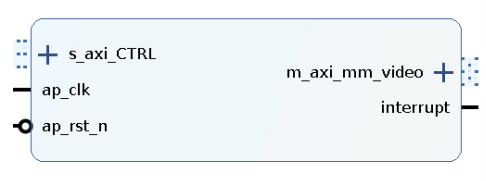
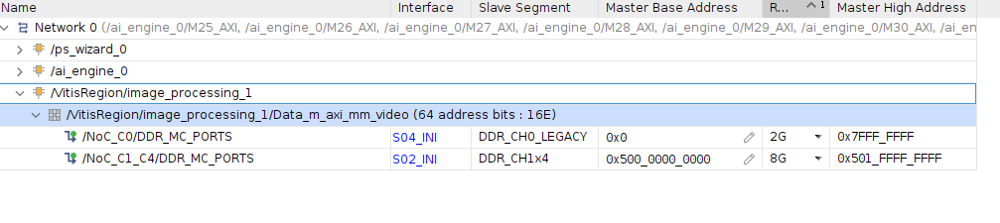
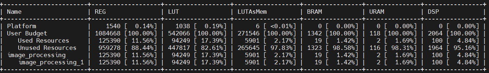

Pre-processing Kernel
=====================

Pre-processing in machine learning is a crucial step that involves preparing and transforming data into a suitable format given as input to the machine learning models.

Examples of pre-processing tasks include resizing, color space conversion, mean subtraction, and normalization. Although these operations can be achieved in software, the performance benefit is substantial when accelerated in hardware. We use a Vitis High-Level Synthesis (HLS) kernel named “Image Processing” that can be implemented in the Programmable Logic (PL) region of the Versal Adaptive SoC for pre-processing.

Features of the Pre-processing Kernel
-------------------------------------

- Memory-mapped AXI4 interface
- Supports spatial resolutions from 16 × 16 up to 3840 × 2160
- Converts input color images of one size to output color images of a different size
- Can process four pixels per clock
- The pre-processing PL IP is clocked at 300MHz.
- Supports INT8 pixel data types of RGB8, BGR8, RGBX8, BGRX8, RGBP (Planar RGB), NV12, and GRAY8 formats for both input and output.
- Supports FP32 pixel data types: RGB_FLOAT, RGBP_FLOAT (Planar RGB), BGR_FLOAT, and GRAY32_FLOAT, available only on the output side.

  .. note::
     FP32 pixel formats store pixel data as a float data type in 4 bytes instead of a single byte.

- Supports BF16 pixel data types: RGBx_BF16, BGRx_BF16, and GRAY_BF16, available only on the output side.

  .. note::
     BF16 formats store pixel data as BF16 (Brain Float 16) in 2 bytes instead of a single byte.

- Dynamically configurable source and destination buffer addresses
- Supports bilinear interpolation for resizing
- Supports 64-bit DDR memory address access
- Supports interrupts to notify the APU upon kernel completion

Pre-processing Kernel Block Diagram
-----------------------------------

Address Mapping of the Pre-processing Kernel
--------------------------------------------

The Vitis tool links the pre-processing kernel to the pre-defined Vitis platform. Upon linking, the kernel interfaces are automatically connected to the corresponding IPs. The AXI4-Lite interface of the pre-processing kernel allows you to dynamically control parameters within the core. These kernel registers can be configured through the AXI4-Lite interface by using VART X pre-processing APIs running on the APU.

The following diagram shows the address mapping of the pre-processing PL kernel in the X+ML Reference Design.

Pre-processing Resource Utilization
-----------------------------------

Pre-processing is implemented using PL hardware on the VE38502 Versal Adaptive SoC device that is present on the VEK385 board. The following table summarizes the resource utilization numbers of this kernel.

+-----------+----------+-------------+
| Resource  | Quantity | Utilization |
+===========+==========+=============+
| LUT       | 94249    | 17.39%      |
+-----------+----------+-------------+
| FF        | 125390   | 11.56%      |
+-----------+----------+-------------+
| BRAM      | 19       | 1.42%       |
+-----------+----------+-------------+
| URAM      | 2        | 1.69%       |
+-----------+----------+-------------+
| DSP       | 100      | 4.84%       |
+-----------+----------+-------------+

System Resource Utilization
---------------------------

Refer to the following table for system resource utilization of X+ML reference design.

