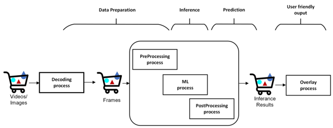
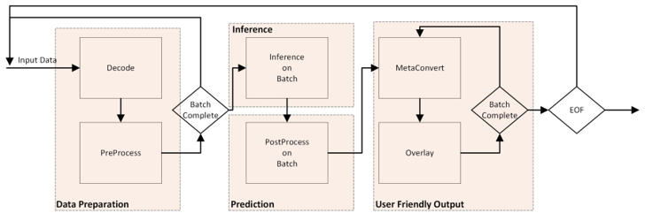
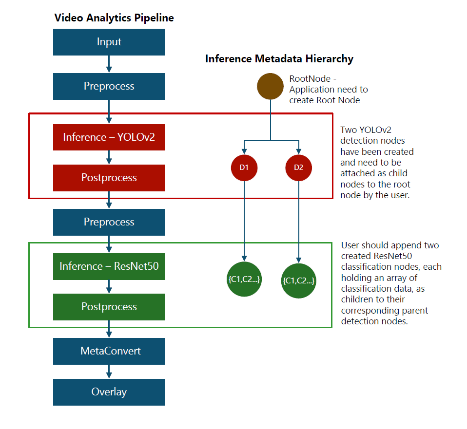
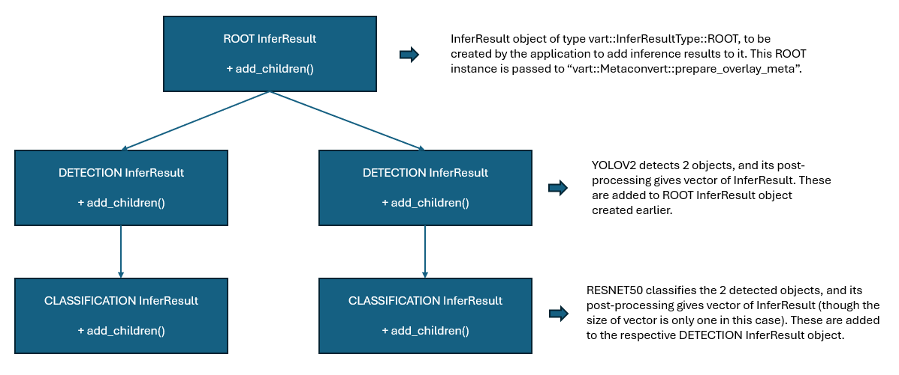
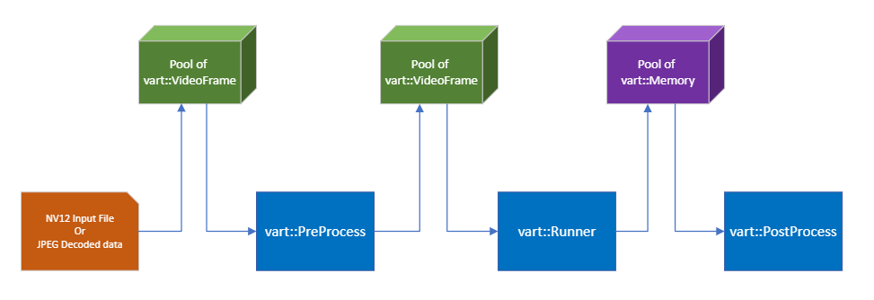

#####################################
VART APIs Application Developer Guide
#####################################

Introduction
============

AMD offers a robust AI solution tailored for accelerating machine learning and deep learning workloads at the edge. This solution combines advanced hardware platforms with a comprehensive software stack, including an optimized compiler and versatile runtime environments, enabling efficient deployment and execution of AI models directly on edge devices.

Compiler and Runtime
--------------------

The AMD’s Vitis AI compiler transforms models from popular ONNX framework into formats optimized for AMD edge hardware, ensuring high performance and low latency. For model execution, AMD provides multiple runtime options:

VitisAIExecution Provider (ONNX Runtime)
~~~~~~~~~~~~~~~~~~~~~~~~~~~~~~~~~~~~~~~~

This integration allows users to run models through ONNX Runtime using the VitisAIExecution Provider. Models that are not fully offloaded to the accelerator can still execute, with portions running on the CPU and others on the accelerator, offering flexibility for diverse workloads.

VART Runner (VART-ML)
~~~~~~~~~~~~~~~~~~~~~

For models fully offloaded to AMD accelerators, the VART Runner delivers efficient, high-throughput execution that maximizes hardware use, minimizes latency, and enables zero-copy inference. VART-ML implements the VART Runner, providing consistent, user-friendly interfaces that simplify interaction with AMD AI platforms by abstracting underlying complexities. It supports efficient, high-throughput execution for models fully offloaded to AMD accelerators, maximizing hardware utilization, minimizing latency, and enabling zero-copy inference.

VART-X
~~~~~~

VART-X extends the capabilities of the AMD AI solution by offering comprehensive APIs for:

- AMD Device Management: Handles hardware context and XCLBIN loading on the device.
- Video Frame and Memory Management: Manages video frames and raw memory allocation/deallocation, read/write for both CPU and device, optimizing data flow and resource usage.
- Preprocessing: Hardware accelerated Pre-processing support using image-processing IP.
- Postprocessing: Post processing for several models
- Multi-level Inference Results Representation: Supports hierarchical representation of inference results, enabling advanced analytics and decision-making.
- Overlaying Multi-level Inference Results on Video Frames: Facilitates visualization by overlaying inference outcomes directly onto video streams.

These features make VART-X ideal for edge applications that require efficient device management, advanced video processing, and rich inference result handling.

For detailed information on VART APIs signatures and parameters, see the VART APIs documentation titled VART-X APIs and VART-ML APIs.

Choosing Between VitisAI Execution Provider and VART Runner for Model Deployment
--------------------------------------------------------------------------------

When deploying AI models on AMD platforms, it is important to select the appropriate runtime based on your model’s compatibility and performance requirements. The two primary options are the VitisAI Execution Provider for ONNX Runtime and the VART Runner (VART-ML). The table below summarizes when to use each:

.. list-table:: Feature/Scenario Comparison
   :widths: 20 40 40
   :header-rows: 1

   * - Feature/Scenario
     - VitisAI Execution Provider (ONNX Runtime)
     - VART Runner (VART-ML)
   * - Integration
     - ONNX Runtime
     - VART-ML (Vitis AI Runtime)
   * - Model Offloading
     - Supports partial offloading: some layers on accelerator, others on CPU
     - Designed for full offloading: entire model runs on AMD accelerator
   * - Flexibility
     - High: can run mixed workloads (CPU + accelerator)
     - Best for models that are fully supported by the accelerator
   * - Performance
     - Good, but may be limited by CPU-executed layers
     - Maximizes hardware utilization, minimizes latency, enables zero-copy inference
   * - Interface
     - ONNX Runtime API
     - VART-ML API (user-friendly, abstracts hardware details)
   * - Use Case
     - When your model contains unsupported layers for the accelerator, or you need ONNX Runtime compatibility
     - When your model is fully supported by the accelerator and you want maximum throughput and efficiency
   * - Zero-Copy Inference
     - Not guaranteed
     - Supported
   * - Best For
     - Heterogeneous or partially supported models, ONNX ecosystem integration
     - High-throughput, low-latency, production inference on AMD accelerators

Video Analytics Pipeline
========================

Video analytics use cases are critical across industries for enhancing security, streamlining operations, and improving decisions.

A typical video analytics pipeline, shown below, involves pre-processing the input video or image, running inference, and post-processing results to extract meaningful insights.




This document explains the video analytics use case through two applications: x_plus_ml_ort (based on ONNX Runtime) and x_plus_ml_vart (based on VART-ML). Both implement an end-to-end video analytics pipeline using VART APIs and share all features except inference.

They use VART-X for preprocessing, postprocessing, and overlaying inference results, supporting single-level inference with JPEG image input.

These applications demonstrate VART API usage and support developing various video analytics solutions.

Since these applications differ only in inference, this document refers to both as x_plus_ml_app.

Application Overview
====================

This section provides an overview of the x_plus_ml_app. To simplify understanding, this document focuses on key steps. Users can refer to the application source code for details.

The application starts by receiving in input image in JPEG format, it then decodes JPEG input to raw data using OpenCV. It then preprocesses, performs inference, post-processes, and overlays inference results on the frames.

The application's main functions include:

1. Initialization: Creating and configuring various VART-X module and Inference (ONNX Runtime or VART-Runner) instances.

2. Main loop

    - Read input image, decode and preprocess it.
    - Perform inference on the preprocessed frame.
    - Post-process output tensors from the inference module.
    - Draw predictions on frame.

3. Cleanup



Initialization
--------------

The initial step involves creating contexts for various VART components, including device management, preprocessing, inference, and post-processing and overlay. Refer to the `create_all_context()` function of `x_plus_ml_app` for detailed implementation. This function is responsible for setting up the required resources and configurations of each component to function effectively within the application’s pipeline. A brief description of the initialization requirements of various VART components of an inference pipeline follows:

Device
~~~~~~

Device handle is a mandatory requirement for each VART module. All VART module APIs take Device handle (`vart::Device`) as one of the mandatory parameters. An application must create/obtain a device handle using the following API:

.. code-block::

   static std::shared_ptr<Device> vart::Device::get_device_hdl(const int32_t dev_idx, const std::string& xclbin_loc)

This function requires two parameters:

- dev_idx: Specifies the index of the device on which the VART component needs to operate.

- xclbin_location: Indicates the location of the xclbin file. The xclbin file name is mandatory for modules utilizing hardware accelerators.

VideoFrame
~~~~~~~~~~

`vart::VideoFrame` is a fundamental component that holds the frame data and carries it through the pipeline from one module to the other within the VART framework. There are three different APIs to create `vart::VideoFrame` object depending on the requirements. Details about each of these APIs are mentioned below:

.. code-block::

   vart::VideoFrame(VideoFrameImplType type, size_t size, uint8_t mbank_idx, VideoInfo &vinfo, std::shared_ptr<Device> device);

This API creates a new vart::VideoFrame object and allocates memory to store the Image/frame data. There are two types of VideoFrame implementation based on type of allocated memory. One implementation allocates physically contiguous memory using XRT (Xilinx Run Time) and the other allocates memory using malloc. It requires parameters such as the frame implementation type, size of the frame, memory bank index, video information (vinfo), and device handle created above.

.. code-block::

    vart::VideoFrame(VideoFrameImplType type, uint8_t mbank_idx, std::vector<xrt::bo *>& bo_vec, VideoInfo& vinfo, std::shared_ptr<Device> device);

This API creates a new vart::VideoFrame object but it doesn't allocate any memory for the image/frame data. It wraps the physically contiguous memory already allocated by the caller and passed as "bo" to this API. This pre-allocated memory is physically contiguous and allocated using Xilinx Run Time (XRT) APIs. It accepts parameters including the frame implementation type, memory bank index, a vector of XRT buffer objects (bo_vec), video information (vinfo), and device handle.

.. code-block::

    vart::VideoFrame(VideoFrameImplType type, std::vector<uint8_t *>& data_vec, VideoInfo& vinfo, std::shared_ptr<Device> device);

This API creates a new vart::VideoFrame object but it doesn't allocate any memory for the image/frame data. It wraps the memory that is already allocated by the caller and passed as data_vec. Please note that this memory is not allocated using the XRT framework. This API requires parameters such as the frame implementation type, a vector of data pointers (data_vec), video information (vinfo), and a shared pointer to the device.

mbank_idx: argument specifies the memory bank index on which memory needs to be allocated or has already been allocated in case of user-provided XRT memory. For currently supported platform the memory bank index is 0.

vart::VideoInfo: structure contains frame information, including padding and alignment. As preprocessing module may have specific alignment requirements, the application obtains vart::VideoInfo from the preprocessing module and creates a pool of frames for efficient memory utilization.

device: Handle to the device, which this module will utilize.

PreProcess
~~~~~~~~~~~

Preprocessing is an important module providing features like resize, color conversion, normalization, and quantization of input frame/image data to prepare it for ML operations. The application creates PreProcess module instance using the API mentioned below:

.. code-block::

   vart::PreProcess(PreProcessImplType type, std::string& json_data, std::shared_ptr<Device> device)
The parameters for this API are as follows:

- **PreProcessImplType**: There are two types of pre-processing implementations are provided in this release. One is hardware accelerated pre-processing and the other is pure software pre-processing. This parameter specifies the type of VART-provided preprocessing module to be used. For example, `vart::PreProcessImplType::IMAGE_PROCESSING_HLS` is being used in the current application for hardware-accelerated image processing IP.

- **json_data**: This parameter can be used to pass the additional preprocessing related configuration information. This information shall be in JSON format.

- **device**: Handle to the device, which this module will utilize.

Additionally, `set_preprocess_info` method allows setting the initial requirements of the `vart::PreProcessor`.

.. code-block::

   vart::PreProcess::set_preprocess_info(PreProcessInfo& preprocess_info)

The vart::PreProcessInfo structure includes parameters such as:

.. list-table::
   :widths: 20 40
   :header-rows: 0

   * - qt_fctr
     - Quantization factor value
   * - mean_r, mean_g, mean_b
     - Mean values for the red, green, and blue channels
   * - scale_r, scale_g, scale_b
     - STD values for the red, green, and blue channels
   * - height
     - Output height
   * - width
     - Output width
   * - colour_format
     - Color format of the required output
   * - preprocess_type
     - PreProcess type to maintain aspect ratio, PANSCAN/LETTERBOX
   * - symmetric_padding
     - Symmetric padding for letterbox preprocess type

These are model specific parameters and using these parameters, pre-process module will prepare the image/frame for infer module.

The combination of preprocess_type and symmetric_padding provides flexibility for special cropping of input images.

Letterbox Preprocessing: When preprocess_type is set to Letterbox, the destination rectangle maintains the same aspect ratio as the source rectangle. Depending on the aspect ratio comparison, it adjusts either the height or the width of the destination rectangle. If symmetric_padding is enabled, it centers the destination rectangle within its original dimensions.

Panscan Preprocessing: When preprocess_type is set to Panscan, it adjusts the Region of Interest (ROI) for an image to match a target aspect ratio. This is achieved by cropping either the top and bottom or the left and right of the input ROI, depending on the aspect ratio comparison.

Applications must handle the transposition of detection results when using detection-type models, ensuring they align with the input provided to the inference process.

vart::VideoInfo carries the information like alignment adjusted width, height, and format information for an image/frame. The alignment requirements may be different for different implementations. User needs to provide the original width, height and format information and the alignment adjusted width and height information are provided by Pre-process module methods. vart::PreProcess module provides below mentioned methods for obtaining the required vart::VideoInfo.

.. code-block::

   vart::PreProcess::get_input_vinfo(int32_t height, int32_t width, VideoFormat fmt, VideoInfo& vinfo);
   const VideoInfo& vart::PreProcess::get_output_vinfo();

The API ``vart::PreProcess::get_input_vinfo(int32_t height, int32_t width, VideoFormat fmt, VideoInfo& vinfo)`` fills the vart::VideoInfo structure based on the user provided Height, Width and VideoFormat. This structure is later used to create the input vart::VideoFrame for the preprocess module.

Similarly, the API ``vart::PreProcess::get_output_vinfo()`` returns the vart::VideoInfo that can be used to create the output vart::VideoFrame for the preprocess module. The vart::VideoInfo is used to decide the memory requirement for the vart::VideoFrame.

Inference
~~~~~~~~~~

This document presents two types of APIs for running ML: ONNXRT APIs and VART Runner. We will explore both options in the following sections, starting with creating the ONNX RT session or VART Runner. You can choose either path.

Creating Session using ONNXRT
^^^^^^^^^^^^^^^^^^^^^^^^^^^^^

`ONNX Runtime <https://onnxruntime.ai/>`_ is a high-performance engine for running deep learning models, supporting both inference and training execution. It provides user-friendly C and C++ APIs for integrating precompiled models into your application workflows. The C++ runtime application and workflow share similarities with the Python implementation, making it easier for users to transition between the two languages. By compiling models with VitisAI, you can leverage ONNX Runtime’s C++ APIs to deploy those models on hardware and perform inference efficiently.

For further details about ONNX Runtime C++ APIs, refer to the official `ONNX Runtime documentation <https://onnxruntime.ai/docs/api/c/c_cpp_api.html>`_.

We first create an ONNX Runtime session and configure it with the options required for the VitisAI Execution Provider. This ensures the model is executed efficiently on AMD hardware.

The Ort::Env object initializes the ONNX Runtime environment, sets up global resources, and configures logging. The Ort::SessionOptions enables customization of session behavior, including execution providers and optimization settings. First, initialize the ORT environment, then create the SessionOptions to configure session behavior.

.. code-block::

    Ort::Env env(ORT_LOGGING_LEVEL_WARNING, "Default");
    Ort::SessionOptions session_options;

Fill in the Vitis AI specific options to ensure the Vitis AI Execution Provider detects the compiled model.

.. code-block::

    std::unordered_map<std::string, std::string> options;
    options["config_file"] = "./vitisai_config.json"; // Path to VitisAI configuration file
    options["cacheDir"] = "./my_cache_dir"; // Directory containing compiled model cache
    options["cacheKey"] = "resnet50_quantized_xint8"; // Key for the compiled model cache

- config_file: Specifies the path to the VitisAI configuration file, which contains hardware and model-specific settings.

- cacheDir: Points to the directory where compiled model artifacts are stored. This should match the output directory used during model compilation.

- cacheKey: Identifies the specific compiled model cache to use for inference.

.. note::

   Execution provider options that are filled should be aligned with the Vitis AI compiled model to ensure optimal performance and compatibility during inference.

Following step registers the VitisAI execution provider with the session, enabling hardware-accelerated inference on AMD platforms.

.. code-block::

    session_options.AppendExecutionProvider("VitisAI", options);

Onnx Runtime Session can be created using the initialized environment, the path to the ONNX model, and the configured session options.

.. code-block::

    Ort::Session session(env, model_path, session_options);

This session is now ready to perform inference using the VitisAI execution provider.

Before running inference with an ONNX model, know the names of the input and output tensors.   These names tell ONNX Runtime which data corresponds to which input tensor, and which outputs you want to retrieve. The following snippet shows how to retrieve input and output tensor names from an ONNX Runtime session:

.. code-block::

    // Create an allocator for managing memory of tensor names
    Ort::AllocatorWithDefaultOptions allocator;

    // Retrieve the number of input tensors
    size_t num_inputs = session.GetInputCount();
    std::vector<const char*> input_names;
    std::vector<Ort::AllocatedStringPtr> input_name_ptrs;

    // Get input tensor names
    for (size_t i = 0; i < num_inputs; i++) {
        input_name_ptrs.emplace_back(session.GetInputNameAllocated(i, allocator));
        input_names.push_back(input_name_ptrs.back().get());
    }

    // Retrieve the number of output tensors
    size_t num_outputs = session.GetOutputCount();
    std::vector<const char*> output_names;
    std::vector<Ort::AllocatedStringPtr> output_name_ptrs;

    // Get output tensor names
    for (size_t i = 0; i < num_outputs; i++) {
        output_name_ptrs.emplace_back(session.GetOutputNameAllocated(i, allocator));
        output_names.push_back(output_name_ptrs.back().get());
    }

    // Why names matter?
    // The names tell ONNX Runtime which data corresponds to which input tensor, and which outputs you want to retrieve.

Creating VART Runner (VART-ML)
^^^^^^^^^^^^^^^^^^^^^^^^^^^^^^

The vart::Runner class in AMD’s AI framework offers a unified interface for executing inference tasks on machine learning models, optimized for AMD hardware. It enables users to query detailed input and output tensor metadata including support for zero-copy operations run synchronous inference and efficiently manage asynchronous jobs using handles or callbacks. Designed to leverage AMD’s hardware capabilities, the Runner class streamlines model execution and provides flexible options for job management and high-performance inference at the edge.

The vart::Runner instance is created using the API mentioned below.

.. code-block::
    std::shared_ptr<vart::Runner> create_runner(
      vart::DeviceType device,
      const std::string& model_path,
      const std::unordered_map<std::string, std::any>& options = {});

- Parameter ``device`` specifies AMD platforms. See VART-ML documentation for supported platforms.

- Parameter ``model_path`` is the path to the Vitis AI compiled model.

- Parameter ``options`` specifies device or platform options. See VART-ML documentation for supported options per platform.

Below API returns the tensor metadata of the provided model:

.. code-block::
    std::vector<vart::NpuTensorInfo>& vart::Runner::get_tensors_info(
      const vart::TensorDirection& direction,
      const vart::TensorType& type);

- Parameter ``direction``: tensor input or output direction

- Parameter ``type``: tensor type, CPU or HW. AI engines use distinct memory layouts and data types that may differ from the models. CPU tensor type matches the model's original tensor information, while HW tensor type represents the AI engine's internal format.

This method returns ``vart::NpuTensorInfo``. Refer to the VART-ML documentation for details on this structure.

Below API provides the Quantization parameters for each tensor:

.. code-block::

     const vart::QuantParameters& vart::Runner::get_quant_parameters(
      const std::string& tensor_name);

- Parameter tensor_name: Name of the tensor requiring quantization parameters

There are other APIs which provide basic information about the model

.. code-block::
    size_t vart::Runner::get_num_input_tensors(); //Returns number of input tensors
    size_t vart::Runner::get_num_output_tensors(); //Returns number of output tensors
    size_t vart::Runner::get_batch_size(); //Returns the batch size


Post-processing
~~~~~~~~~~~~~~~

Post-processing module performs few additional operations on the output tensor data from the infer module and produces meaningful/user understandable inference results. Post-processing operation is model specific, and this release provides post-processing modules for Resnet50, YOLOV2, and SSDResnet34. User may want to add new post-processing support or add new inference result data structures. For this, user may refer to `Adding custom implementation for VART::PostProcess and VART::InferResult <https://amd.atlassian.net/wiki/pages/createpage.action?spaceKey=~suregupt&title=VARTAPIsApplicationDeveloperGuide-adding_custom_pp_ir&linkCreation=true&fromPageId=152109078>`_.

The post-processing module instance can be created using the API mentioned below:

.. code-block::

    vart::PostProcess(PostProcessType postprocess_type, std::string& json_data, std::shared_ptr<Device> device);

This API accepts parameters including:

- PostProcessType: Specifies the post-processing implementation class to invoke, allowing users to select the desired post-processing method.

- json_data: Post-processing specific additional configuration information can be provided using this parameter. This information shall be in JSON format.

- device: Handle to the device which this module will utilize.

Sample JSON string required by the vart::PostProcess module for ResNet50

.. code-block::
    {
   "topk" : 1,
   "label_file_path": "resnet50_labels.txt",
    "type" : "RESNET50",

    }

After initializing the post-processing instance, additional model specific information necessary for post-processing is provided using below method.

.. code-block::
    vart::PostProcess::set_config(std::vector<TensorInfo>& tensor_info, uint32_t batch_size);

The TensorInfo structure contains the following parameters:

- **name**: Name of the tensor

- **tensor_datatype**: Tensor data type (INT8, BF16, FLOAT32)

- **scale_coeff**: The quantization factor to be used.

- **size**: The size of the tensor in bytes

- **shape**: The shape of the tensor.

.. code-block::
    All the above mentioned parameters can be obtained from vart::Runner using the code mentioned below.

Meta Convert
~~~~~~~~~~~~

The Meta Convert module interprets inference results from post-processing module and converts them into a format that overlay modules can understand. The overlay module processes information related to text, bounding boxes, arrows, circles, etc. This structured overlay data is then used to annotate an input image with the inference results.

To create the meta-convert module instance, the application can use the vart::MetaConvert API mentioned below:

.. code-block::
    vart::MetaConvert (InferResultType infer_res_type, std::string& json_data, std::shared_ptr<Device> device);

This API takes below parameters:

- **InferResultType**: Specifies the type of inference result (e.g., classification or detection), to be parsed by the MetaConvert module.

- **device**: Handle to the device which MetaConvert module will utilize.

- **json_data**: From the inference results produced by the post-processing module, user may select for which type of objects the information to be displayed, and what shall be the font size etc. That configuration information can be provided to the meta convert module in JSON format using this parameter. In the reference sample application, this information is extracted from the application's JSON settings provided by the user and passed to the meta convert module.

A sample JSON configuration for vart::MetaConvert is mentioned below:

.. code-block:: json

    {
        "display-level": -1,
        "font-size" : 0.5,
        "font" : 3,
        "thickness" : 2,
        "radius": 5,
        "mask-level" : 0,
        "y-offset" : 0,
        "draw-above-bbox-flag" : true,
        "label-filter" : [ "class"],
        "label-color" : [
            {"level": 1, "red" : 0, "green" : 0, "blue" : 255 },
            {"level": 2, "red" : 0, "green" : 255, "blue" : 0 },
            {"level": 3, "red" : 255, "green" : 0, "blue" : 0 }
        ],
        "classes" : [
            {
                "name" : "bird",
                "blue" : 255,
                "green" : 0,
                "red"  : 0,
                "masking"  : 0
            }
        ]
    }

We can add more elements in classes array to mask other classes to display. And if user want all classes to display then he can remove or empty the classes array. For more detailed usage of parameters please follow below table.

.. list-table:: Parameter Details
   :widths: 20 20 60
   :header-rows: 1

   * - Parameter
     - Expected Values
     - Description
   * - font
     - 0 to 7
     - Below is the list of text font values and its description:
       - 0: Hershey Simplex (default)
       - 1: Hershey Plain
       - 2: Hershey Duplex
       - 3: Hershey Complex
       - 4: Hershey Triplex
       - 5: Hershey Complex Small
       - 6: Hershey Script Simplex
       - 7: Hershey Script Complex
   * - font-size
     - 0.5 to 1
     - Font fraction scale factor that is multiplied by the font-specific base size. Default value is 0.5.
   * - thickness
     - Integer 1 to 3
     - The thickness of the line that makes up the rectangle. Negative values like -1, signify that the function draws a filled rectangle. The recommended value is between 1 and 3. Default line thickness value is 1.
   * - label-color
     - {"level":1, "blue":255, "green":0, "red" : 0} Level 0 to N
       - 0: all levels
       - N: specific level
       - blue: 0 to 255
       - green: 0 to 255
       - red: 0 to 255
     - Using this field, the user can assign bounding box and label color to particular level in inference results tree. The user needs to pass as array with level, blue, green and red parameters. Here all parameters of the array are mandatory to parse. For instance, if the user wants to change the color for level 2 then it will be {"level": 2, "blue" : 0, "green" : 255, "red" : 0}. If label-color is not parsed, then it will take default colors. Default color scheme will be as below.
       - level 1: blue
       - level 2: green
       - level 3: red
       - all other level: aqua
     - Label and bounding box color will affect with following precedence order.
       1. Color parse in classes object. For example, if user parse classes as car then color will consider from classes field.
       2. Color parse in particular level in label-color array.
       3. If 0 level parse then all level will affect.
       4. If none of above define, then use default color from code.
   * - label-filter
     - ["class", "probability"]
     - This field controls what should be displayed in label string. The addition of "class" in the array adds the ML classification name. For example, car, person, etc. The addition of "probability" in the array adds the probability of a positive object identification. By default classification name will be displayed.
   * - y-offset
     - Integer 0 to height
     - 'y' offset to be added along height for label in case of classification model.
   * - classes
     - {"name":"car", "blue":255, "green":0, "red" : 0}
     - This is a filtering option when using the Overlay. The bounding box is only drawn for the classes that are listed in this configuration and other classes are ignored. For instance, if "car", "person", "bicycle" is entered under "classes", then the bounding box is only drawn for these three classes, and other classes like horse, motorbike, etc. are ignored. The expected value columns show an example of how each class should be described. All objects in this example, by class, are using the color combination listed. The class names in this list matches the class names assigned by the InferResult. Otherwise, the bounding box is not drawn.
   * - display-level
     - Integer 0 to N
       - -1: display information at all the levels
       -  0: do not display anything
       -  N: specific level
     - Display bounding box of one particular level or all levels.
   * - draw_above_bbox_flag
     - True/False
     - Label will be displayed on top of the bounding box if set to True. Default value is True.
   * - radius
     - Integer
     - Represents Radius of circle, also used for point. Default value is 3.

Generating N-ary tree
^^^^^^^^^^^^^^^^^^^^^

Metaconvert takes the root node of an N-ary tree of vart::InferResult objects as input and traverse through the tree to interpret results from all inference levels to populate the shape information to be overlayed on the input image. The tree structure input enables metaconvert to handle both single and cascaded inference cases.

In case of single level inferencing, the root node will have only one level of children. vart::InferResult class provides interfaces to build the tree structure, application has to use these interfaces to build the tree. Below snippet of code shows how to create the N-ary tree for single level inference case.

.. code-block:: cpp

    /* Create MetaConvert object, its constructor arguments are explaineded in following text */
    meta_convert = new vart::MetaConvert(infer_result_type,
                                         metaconvert_config,
                                         device);
    /* Run post-processing on inference output tensors for "batch_size" of frames */
    vector<vector<shared_ptr<InferResult>>> inference_results = post_process->process(tensor, batch_size);
    std::vector<std::shared_ptr<InferResult>> root_res;
    for (uint32_t i = 0; i < batch_size; i++) {
      /* Create a dummy root node to build the tree */
      root_res.push_back(std::make_shared<InferResult>(InferResultType::ROOT));
      if (inference_results.size()) {
       /* Add inference results as children to the root node */
       (root_res.back())->add_children(inference_results[i]);
      }
      shared_ptr<OverlayShapeInfo> shape_info = meta_convert->prepare_overlay_meta(root_res.back());

In cascaded inferencing cases, application can keep adding the results from each level to its previous level as children. Let us consider the below cascaded inferencing case to understand tree construction. The input image goes through the a detection model like yolov2 and followed by resnet50 to classify each detected object. At the end metaconvert and overlay will do the job of overlaying the inference results on to the input image.



Below tree diagram depicts the course of the tree construction for the above cascaded case.



Overlay
~~~~~~~

The overlay module draws the results of inference onto the input frame using the information from overlay Meta data structure generated by the meta-convert process. To create the overlay module instance, use the API mentioned below:

vart::Overlay (OverlayImplType overlay_impl_type, std::shared_ptr<Device> device);

This API takes below mentioned parameters:

OverlayImplType: Specifies the implementation type to be instantiated for the overlay functionality. Currently VART APIs supports only one implementation, based on OpenCV, for the Overlay functionality and is represented by vart::OverlayImplType::OPENCV.

device: Handle to the device which this module will utilize.

Main Processing
---------------

This section covers details about how to use various VART APIs to perform the specific task, like pre-processing, inference, post-processing etc.
The main loop is the central part of the X + ML application where the actual Inference processing takes place. It follows a series of steps in each iteration to handle frames from the input video.

Frame Acquisition
~~~~~~~~~~~~~~~~~

The initial step in the main loop involves obtaining frames and populating them with data from the input video stream. The method of acquiring frames varies based on the specific implementation of the application. VART APIs expects frames with raw video data in formats like BGR, RGB, RGBX, BGRX or NV12. Users can refer to the x_plus_ml_app application's VideoFramePool, as well as the read_input() (in video_input_output.cpp file) function, for insight into how to read data directly into frames from either raw input or an encoded input stream. Once the application has frames containing input video data in formats like BGR or NV12, these frames are forwarded to vart::PreProcess to generate input for inference.

Preprocessing
~~~~~~~~~~~~~

Preprocessing involves applying necessary transformations or adjustments to frame data to prepare it for input to the neural network model, ensuring that it meets the model's requirements.

``Vart::PreProcess`` provides the below mentioned API to perform this operation:

.. code-block::

    vart::PreProcess::process(std::vector<PreProcessOp>& preprocess_ops);

where ``vart::PreProcess::PreProcessOp`` represents one pre-process operation to be performed. It has the following parameters:

.. list-table:: Frame and Region Details
   :widths: 30 70
   :header-rows: 1

   * - Parameter
     - Description
   * - RegionOfInterest in_roi
     - Specifies the region of interest within the input frame
   * - RegionOfInterest out_roi
     - Specifies the corresponding region of interest within the output frame
   * - VideoFrame in_frame*
     - Pointer to the Input frame
   * - VideoFrame out_frame*
     - Pointer to the output frame

Each ``vart::PreProcessOp`` represents an operation to be performed on the input frame. It defines a region of interest within the input frame and in the output frame. The ``vart::PreProcess::process`` method can perform multiple ``vart::PreProcessOp`` operations.

Input frame passed to the preprocess module through PreProcessOps must be created by the VideoInfo obtained from ``vart::PreProcess::get_input_vinfo(int32_t height, int32_t width, VideoFormat fmt, VideoInfo& vinfo)``. Similarly, the output frame must be created by the VideoInfo obtained from ``vart::PreProcess::get_output_vinfo()``.

To understand the usage of the ``vart::PreProcess::process`` method, users can refer to `Vitis-AI-Telluride/examples/cpp_examples/common/src/pre_process.cpp`.

Once preprocessing is complete, the pre-processed frame is passed to the inference module for further machine learning operations.

.. code-block::
    vart::PreProcess::set_preprocess_info(PreProcessInfo& preprocess_info);

During pre-processing a frame, other than the information provided by ``vart::PreProcessOp``, more information may be required, and that information shall be specified through the ``vart::PreProcessInfo`` structure using ``vart::PreProcess`` module during the initialization of the module. Please follow the Initialization section to get more details about ``vart::PreProcessInfo``.

Running Inference
~~~~~~~~~~~~~~~~~

This step involves feeding the preprocessed frames into the model to obtain outputs. Users who opted for ONNX Runtime can follow the section on `Running Inference with ONNX Runtime <https://amd.atlassian.net/wiki/spaces/ACEAIE/pages/1140200674/Application+developer+guide#Running-Inference-with-ONNX-Runtime>`_; others can proceed to the section on `Running Inference with VART Runner <https://amd.atlassian.net/wiki/spaces/ACEAIE/pages/1140200674/Application+developer+guide#Running-Inference-with-VART-Runner>`_.

Running Inference with ONNX Runtime
^^^^^^^^^^^^^^^^^^^^^^^^^^^^^^^^^^^

Before running the session, create the input tensor with the preprocessed data pointer. To create an input tensor for ONNX Runtime, use the ``Ort::Value::CreateTensor`` API. This requires a memory info object, a pointer to your preprocessed input data, the total number of elements, and the tensor shape.

.. code-block:: cpp

    Ort::Value input_tensor = Ort::Value::CreateTensor(
        memory_info,         // Ort::MemoryInfo object specifying memory type (e.g., CPU)
        preprocessed_data_ptr,      // Pointer to preprocessed input data
        input_element_count, // Total number of elements in the input tensor
        input_shape.data(),  // Pointer to the shape array
        input_shape.size()   // Number of dimensions
    );
    input_tensors.emplace_back(input_tensor);

For output tensors, ONNX Runtime can allocate memory automatically. The API requires an allocator, the output shape, and the data type.

.. code-block:: cpp

    Ort::Value output_tensor = Ort::Value::CreateTensor(
        allocator,                // Ort::Allocator for output memory
        output_shape.data(),      // Pointer to output shape array
        output_shape.size(),      // Number of output dimensions
        output_type               // ONNX Tensor Element Type (e.g., ONNX_TENSOR_ELEMENT_DATA_TYPE_FLOAT)
    );
    output_tensors.emplace_back(std::move(output_tensor));

Once you have prepared your input and output tensors, you can execute inference using the ONNX Runtime session’s Run method. This method requires the names and data for both input and output tensors, as well as optional run options.

.. code-block:: cpp

    session->Run(
        Ort::RunOptions{nullptr},      // Optional run options (can be nullptr for default)
        input_names.data(),            // Array of input tensor names
        input_tensors.data(),          // Array of input Ort::Value tensors
        num_input_tensors,             // Number of input tensors
        output_names.data(),           // Array of output tensor names
        output_tensors.data(),         // Array of output Ort::Value tensors
        num_output_tensors             // Number of output tensors
    );

Copy the ``output_tensors`` to ``std::vector<std::vector<std::shared_ptr<vart::Memory>>>`` for post-processing.

Running Inference with VART Runner
^^^^^^^^^^^^^^^^^^^^^^^^^^^^^^^^^^

The ``vart::NpuTensor`` class in VART-ML is designed to wrap user-allocated memory buffers, associating them with essential metadata such as shape, data type, memory location (Host or Device), and tensor type (CPU or HW). Importantly, the ``vart::NpuTensor`` class does not take ownership of the buffer; you remain responsible for managing its lifecycle. This design provides flexibility and control, allowing you to efficiently integrate your memory management with VART-ML’s inference workflow.

.. code-block:: cpp

    vart::NpuTensor(const vart::NpuTensorInfo& info,
                    void* buffer,
                    const vart::MemoryType& mem_type,
                    const vart::TensorType& type = vart::TensorType::CPU);
- **Parameter info**: NpuTensorInfo tensor details returned by ``vart::Runner::get_tensors_info()``

- **Parameter buffer**: User tensor buffer to wrap; a virtual pointer if allocated on CPU, or an ``xrt::bo`` pointer if on device.

- **Parameter mem_type**: Memory type of the buffer: HOST if allocated on CPU, DEVICE if on device.

- **Parameter type**: CPU if buffer is on HOST and non-zero copy flow; HW if buffer is on DEVICE and zero copy flow.

Please refer to `VART APIs Application Developer Guide <https://amd.atlassian.net/wiki/spaces/ACEAIE/pages/1140200674/VART+APIs+Application+Developer+Guide#Zero-Copy-Support>`_ for more info on ``vart::TensorType``.

To perform inference with VART-ML, wrap your input and output buffers using the NpuTensor class. Then run the inference using executeAPI.

.. code-block::
    StatusCode execute(const std::vector<std::vector<NpuTensor>>& inputs, std::vector<std::vector<NpuTensor>>& outputs)

The executeAPI accepts inputs and outputs as ``vector<vector<NpuTensor>>``, where:

- The first dimension represents the batch size.
- The second dimension represents the individual tensors for each input or output in the batch.

After execution, output tensors will be stored in outputs.

For implementation, see `Vitis-AI-Telluride/examples/cpp_examples/x_plus_ml_vart/inference.cpp`.

Post-Processing
~~~~~~~~~~~~~~~

After obtaining the inference results, the application proceeds to perform post-processing tasks on the model output data to generate understandable predicted outputs. Post-processing implementations vary depending on the specific models and algorithms used. The post-processing implementer is responsible for understanding the algorithm and data alignment/placement in the inference output.

VART provides a framework where users can integrate their own post-processing implementations tailored to the requirements of their models. Users must ensure that the output from post-processing conforms to the ``vart::InferResult`` format to maintain compatibility with subsequent modules in the VART pipeline. Please follow the section "Adding a custom post-processing implementation" for more detail to add custom post-process in VART.

The key methods provided by the VART-X framework for post-processing are:

.. code-block:: cpp

    void vart::PostProcess::set_config(std::vector<TensorInfo>& info, uint32_t batch_size);
    std::vector<std::vector<std::shared_ptr<InferResult>>> vart::PostProcess::process(std::vector<int8_t *> data, uint32_t current_batch_size);
    std::vector<std::vector<std::shared_ptr<InferResult>>> vart::PostProcess::process(std::vector<std::vector<std::shared_ptr<vart::Memory>>> tensor_memory, uint32_t current_batch_size);
The ``vart::PostProcess::set_config()`` function is designed to provide the PostProcess module with essential tensor information and batch size. This information is crucial for parsing and processing the tensors. Notably, this method is invoked only once, prior to any calls to ``vart::PostProcess::process()``.

The ``vart::PostProcess::process()`` method is responsible for executing post-processing on a batch of tensors generated by the inference module. It accepts a vector of tensor data, where each pointer in the vector corresponds to a specific tensor. The vector is organized such that it contains the tensors for one frame in sequence, followed by tensors for subsequent frames within the batch. To determine the number of output tensors produced by the model, you can utilize methods from ``vart::Runner`` methods or refer to the ``vart::PostProcess::set_config`` method.

There are two versions of the ``vart::PostProcess::process()`` method. The first version accepts pointers of type ``int8_t``, while the second version takes a ``vector<vector<shared_ptr<vart::Memory>>>``. In this second version, the first dimension represents the batch size, and the second dimension indicates the number of tensors within each batch.

For additional information, please refer to `Vitis-AI-Telluride/examples/cpp_examples/common/src/post_process.cpp`.

The process method generates a ``vector<vector<shared_ptr<InferResult>>>``, where the 'results' vector contains the outcomes for multiple frames. Each inner vector corresponds to the results for an individual frame within the batch. Each ``InferResult`` object comprises the processed output data, which is prepared for subsequent use.

Inference Result
~~~~~~~~~~~~~~~~~

The output of ``vart::Postprocess`` is a ``vector<vector<shared_ptr<InferResult>>>``, where each element holds a vector of class ``vart::InferResult`` for each valid prediction in the batch of frames. Each ``vart::InferResult`` contains the processed output data ready for further utilization.

``vart::InferResult`` provides an API to transform the inference results for the image resolution on which inference was performed to the results for an image of different resolution. Typically, in video pipelines, the input resolution differs from the resolution of the machine learning model. After preprocessing, the model operates on the preprocessed data and generates results based on the input resolution to the model. The transform method in ``vart::InferResult`` accomplishes this transformation.

.. code-block::
    vart::InferResult::transform(InferResScaleInfo& info);

Where ``vart::InferResScaleInfo`` contains the width_scale_factor and height_scale_factor for the conversion.

Additionally, ``vart::InferResult`` provides the ``vart::InferResult::get_infer_result()`` method to obtain the actual user-understandable structure for each type of Inference. The output of ``get_infer_result()`` is typecast to the actual result data structure and used as per the requirement.

``vart::InferResult`` supports two types of data structures: ``ClassificationResData`` and ``DetectionResData``.

.. list-table:: InferResult Data Structures
   :widths: 30 70
   :header-rows: 1

   * - Parameter
     - Description
   * - ClassificationResData
     - ``std::vector<std::string> label``: Vector of label strings in classification result
     - ``std::vector<double> confidence``: Vector of probability score in classification result
     - ``std::vector<uint8_t> index``: Index of the class
   * - DetectionResData
     - ``int32_t x``: X co-ordinate of top left corner of the bounding box of detected object
     - ``int32_t y``: Y co-ordinate of top left corner of the bounding box
     - ``uint32_t width``: Width of the bounding box
     - ``uint32_t height``: Height of the bounding box
     - ``std::string label``: Label strings of detected object
     - ``double confidence``: Probability score of the infer result

For usage of the results, please refer to ``postprocess_process_frames()`` or ``transform_infer_result()`` functions in ``x_pluss_ml_app``. Please follow the section "Adding a custom Inference result type" for more detail to add custom InferResult type in VART-X.

Visualizing Model Predictions
~~~~~~~~~~~~~~~~~~~~~~~~~~~~~

In ML pipelines, it's often useful to visualize the inference results produced by the model directly on the input frames. This involves tasks such as drawing bounding boxes around detected objects, labeling objects, or applying other visual enhancements based on the model's predictions.

VART provides modules, ``vart::MetaConvert``, for converting ``vart::InferResult`` to an overlay data structure and then ``vart::Overlay`` module overlays the detections onto ``vart::Frame``.

To convert all ``InferResult`` data for each frame into overlay data structure, use the API mentioned below:

.. code-block:: cpp

    std::shared_ptr<OverlayShapeInfo> vart::MetaConvert::prepare_overlay_meta(std::vector<std::shared_ptr<InferResult>> infer_res);

The above API prepares and returns a ``vart::OverlayShapeInfo`` structure that is easily understandable by the ``vart::Overlay`` module to draw on a frame. Once the overlay data is prepared, the below method is used to overlay the information onto the frame. The ``shape_info`` parameter contains the data generated by ``prepare_overlay_meta`` of the ``vart::MetaConvert`` class.

.. code-block:: cpp

    vart::Overlay::draw_overlay(VideoFrame& frame, OverlayShapeInfo& shape_info);
For more details about usage of ``vart::MetaConvert`` and ``vart::Overlay``, please refer to the ``draw_infer_result()`` function in the ``x_plus_ml_app``.

Finally, the user can choose to either dump the frame or send it for further processing as per their requirements. In the ``x_plus_ml_app``, the output frame is dumped in raw format to a file and this can be referred in the ``dump_video_frame()`` function in the application.

Cleanup
-------

In the application-specific cleanup phase, the program should release any memory it has allocated and reset all the resources it has utilized. This ensures that the application leaves no loose ends and is ready for future use.

Configuration file for x_plus_ml_ort (ONNX Runtime based)
---------------------------------------------------------

To configure the ``x_plus_ml_ort`` app using JSON, please refer to the `JSON Configuration guide for x_plus_ml_ort <https://amd.atlassian.net/wiki/spaces/ACEAIE/pages/1140103627/CPP+example+applications#Configuration-JSON-Guide-for-x_plus_ml_ort>`_.

Configuration file for x_plus_ml_vart (VART-ML based)
-----------------------------------------------------

To configure the ``x_plus_ml_ort`` app using JSON, please refer to the `JSON Configuration guide for x_plus_ml_vart <https://amd.atlassian.net/wiki/spaces/ACEAIE/pages/1140103627/CPP+example+applications#Configuration-JSON-Guide-for-x_plus_ml_vart>`_.

Zero Copy Support
-----------------

Enabling Zero Copy in VART Runner
~~~~~~~~~~~~~~~~~~~~~~~~~~~~~~~~~

Each AI inference hardware provider, including AMD, designs their AI engines with unique data formats and memory layouts optimized for their architecture especially important for edge devices where efficiency and performance are critical. As a result, the data format and layout required by AMD’s edge AI engines will typically differ from the original ONNX model’s format.

In this context, the CPU tensor type refers to the tensor metadata as defined at the ONNX layer, representing how the model would be executed on a standard CPU. The HW tensor type, on the other hand, corresponds to AMD’s hardware-specific tensor metadata, reflecting the format and layout required for direct execution on AMD edge AI hardware.

The VART-ML framework handles conversions between CPU and HW tensor types. However, these conversions may involve data copies, which can introduce latency and reduce performance an important consideration for edge applications.

To minimize this overhead, users can leverage VART to obtain AMD hardware-specific tensor metadata, prepare their data in the required HW format, and wrap it in the Tensor class as a tensor of type HW. By passing such tensors directly to the run API, users can achieve true zero-copy operation, eliminate unnecessary data movement and maximize inference efficiency on AMD edge devices.

To achieve true zero-copy inference on AMD edge hardware, buffers must be allocated directly on the device using ``xrt::bo``. Users need to understand the hardware (HW) tensor format and memory layout for both input and output tensors. Below are the steps for enabling zero-copy on each side:

To enable zero copy support with user-allocated input and output tensors in ``vart::Runner``, set ``input_tensor_type`` and ``output_tensor_type`` in options to “HW”.

.. code-block:: cpp

    /* Runner Options */
    std::unordered_map<std::string, std::any> options = {
          {"log_level", "INFO"},
          {"input_tensor_type", "HW"},
          {"output_tensor_type", "HW"}};

    std::string model_path = "vai_compiled_model";

    /* Create Runner */
    auto runner = vart::RunnerFactory::create_runner(vart::DeviceType::VAIML, model_path, options);
Zero copy on the input side
^^^^^^^^^^^^^^^^^^^^^^^^^^^

**Query HW Tensor Format**

Use ``vart::Runner`` API to obtain the HW tensor metadata for the input tensor, including shape, data type, and memory layout required by AMD’s edge AI engine.

```cpp
auto input_tensors_info = runner->get_tensors_info(vart::TensorDirection::INPUT, vart::TensorType::HW);

**Allocate Device Buffer**

Allocate the input buffer on the device using xrt::bo, ensuring the buffer size and alignment match the HW tensor requirements.

**Prepare Data in HW Format**

Format your input data according to the HW tensor layout (e.g., channel order, padding, etc.) before copying it into the device buffer.

**Wrap Buffer in Tensor Class**

Wrap the device buffer in a VART-ML vart::NpuTensor object, specifying the tensor type as HW.

.. code-block:: cpp

    std::vector<std::vector<vart::NpuTensor>> inputs = {};
    std::vector<vart::NpuTensor> input = {};
    // Allocate xrt::bo
    xrt::bo* input_bo_ptr = new xrt::bo(xrt_device, in_bo_size, 0);
    vart::NpuTensor input_tensor = vart::NpuTensor(input_tensors_info[0], input_bo_ptr, vart::MemoryType::DEVICE, vart::TensorType::HW);
    input.push_back(std::move(input_tensor));
    inputs.push_back(std::move(input));

**Pass to Run API**

Include the HW tensor in your input batch and pass it to the ``vart::Runner::execute`` API for inference.

Zero copy on the output side
^^^^^^^^^^^^^^^^^^^^^^^^^^^^^

**Query HW Tensor Format for Output**

Use VART to obtain the HW tensor metadata for the output tensor, ensuring you know the required size and layout.

.. code-block::
      auto output_tensors_info = runner->get_tensors_info(vart::TensorDirection::OUTPUT, vart::TensorType::HW);

**Allocate Device Buffer**


Allocate the output buffer on the device using ``xrt::bo``, matching the HW tensor format.

**Wrap Buffer in Tensor Class**

Wrap the device buffer in a VART-ML ``vart::NpuTensor`` object, specifying the tensor type as HW.

.. code-block:: cpp

    std::vector<std::vector<vart::NpuTensor>> outputs = {};
    std::vector<vart::NpuTensor> output = {};
    // Allocate xrt::bo
    xrt::bo* output_bo_ptr = new xrt::bo(xrt_device, out_bo_size, 0);
    vart::NpuTensor output_tensor = vart::NpuTensor(output_tensors_info[0], output_bo_ptr, vart::MemoryType::DEVICE, vart::TensorType::HW);
    output.push_back(std::move(output_tensor));
    outputs.push_back(std::move(output));

**Pass to Run API**

Include the HW tensor in your output batch and pass it to the ``vart::Runner::execute`` API. The inference results will be written directly to your device buffer, avoiding any unnecessary data copies.

.. code-block:: cpp

    try {
      auto ret = app_context.runner->execute(inputs, outputs);
      if (vart::StatusCode::SUCCESS != ret) {
        std::cerr << "Inference failed with error code: " << static_cast<int>(ret) << std::endl;
      }
    } catch (const std::exception& e) {
      std::cerr << "Error during inference: " << e.what() << std::endl;
    }

.. note:: Important:
    For zero-copy to work effectively, users must fully understand the HW tensor format and memory layout for both input and output sides. This ensures that buffers are correctly allocated and formatted, allowing the AI engine to access data directly without intermediate conversions or copies.

Enabling Zero Copy in x_plus_ml_vart
~~~~~~~~~~~~~~~~~~~~~~~~~~~~~~~~~~~~~

Zero-copy is supported between Preprocess and Inference, eliminating the need to copy buffers between these stages. Zero-copy is only possible when the hardware (HW) format required by Inference is also supported by Preprocess. Similarly, to enable zero-copy on the output side, Postprocess must be able to handle the HW format produced by Inference.

In the ``x_plus_ml_vart`` (VART based ``x_plus_ml_app``), zero copy is achieved between the output of ``vart::PreProcess`` and the input of ``vart::Runner``.

Refer to the diagram below to understand buffer allocation and data flow in the ``x_plus_ml_app``.



In the ``x_plus_ml_app``, buffering works as follows:

- An XRT-based input buffer pool of ``vart::VideoFrame`` stores input buffers. It receives data from decoded JPEG files, which it copies into its buffers for processing by ``vart::PreProcess``.

- A separate XRT-based buffer pool of ``vart::VideoFrame`` holds output from ``vart::PreProcess``. This buffer matches the dimensions and format required by ``vart::Runner``, with ``vart::PreProcess`` saving its output here.

- These buffers then serve as input for ``vart::Runner``.

- Another XRT-based buffer pool of ``vart::Memory`` holds output tensors between ``vart::Runner`` and ``vart::PostProcess``. The Runner stores output here, which ``vart::PostProcess`` then processes.

To enable this feature in the ``x_plus_ml_vart`` app, set ``inference-config.runner-options.input-tensor-type`` and ``inference-config.runner-options.output-tensor-type`` to "HW".

Also, set ``preprocess-config.colour-format`` to match the format between the image_processing IP and the HW format of the ``vart::Runner`` input.

For implementation details, refer to ``Vitis-AI-Telluride/examples/cpp_examples/x_plus_ml_vart/inference.cpp``.


