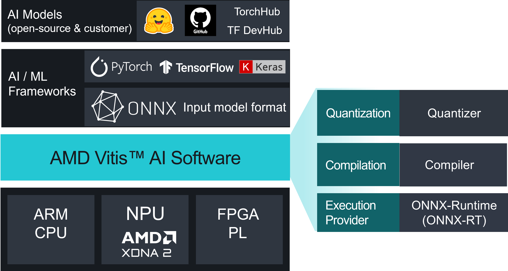

======================================================
Vitis AI 5.1 Versal AI Edge Gen 2 Series Documentation
======================================================

Vitis AI Overview
=================

AMD Vitis AI is an integrated development environment that can be leveraged to accelerate AI inference on AMD Versal AI Edge Gen 2 adaptive SoCs and FPGAs. This toolchain provides optimized IP (Intellectual Property), tools, libraries, models, and resources, such as example designs and tutorials that aid the user throughout the development process. It is designed with high efficiency and ease-of-use in mind, unleashing the full potential of AI acceleration on AMD Versal AI Gen 2 Adaptive SoCs.

Key Components of Vitis AI
~~~~~~~~~~~~~~~~~~~~~~~~~~

The Vitis AI solution consists of three primary components:

1. **Neural Processing Unit (NPU) IP**: The NPU IP is a specialized AI inference IP that leverages the AI Engine Array to accelerate the deployment of neural networks.

2. **Model Compilation Tools**: Tools designed to compile and optimize ML (Machine Learning) models specifically for the NPU IP.

3. **Model Deployment APIs**: Setup scripts, examples, and reference designs to integrate and execute ML models on the NPU IP from a software application.

.. _neural_processing_unit:

Neural Processing Unit
~~~~~~~~~~~~~~~~~~~~~~

AMD uses the acronym NPU IP to identify the soft accelerators that facilitate deep-learning inference. The NPU IP uses the AI Engines (AIE) to implement the inference accelerator.

Vitis AI provides the NPU IP and the required tools to deploy both standard and custom neural networks on AMD adaptable targets.

The Vitis AI NPU IP operates as a general-purpose AI inference accelerator. Multiple NPU IP instances may also be instantiated per device. The NPU IP can be scaled in size to accommodate your requirements.

The NPU IP operates as a micro-coded processor with its own Instruction Set Architecture. Each NPU IP architecture has its own instruction set.

The Vitis AI Compiler, in collaboration with the NPU IP software stack, generates snapshots tailored for the deployment of each network. The snapshot contains a quantized model and instructions for execution by the NPU IP on the target platform.

One advantage of this architecture is that there is no need to load a new bitstream or build a new hardware platform when changing the neural network. This is an important differentiator from data flow accelerator architectures that are purpose-built for a single network.

Model Compilation
~~~~~~~~~~~~~~~~~
Vitis AI Quantizer
^^^^^^^^^^^^^^^^^^

The Vitis AI Quantizer, integrated as a component of ONNX, converts 32-bit floating-point weights and activations to narrower datatypes such as BF16,  minimizing computational complexity with minimal loss of accuracy. This leads to lower memory bandwidth requirements and enhanced throughput and power efficiency compared to the original 32-bit model.

Vitis AI Compiler
^^^^^^^^^^^^^^^^^

Vitis AI supports model compilation through the ONNX Runtime API with Vitis AI Execution Provider (EP). This process enables the Vitis AI EP to build the model, generating the necessary binaries for execution on the NPU.

The Vitis AI Compiler maps the AI quantized model to a highly-efficient instruction set and dataflow model. The compiler performs multiple optimizations; such as fusing batch normalization with convolution operations when the convolution operator precedes the batch normalization operator. As the NPU IP supports multiple dimensions of parallelism, efficient instruction scheduling is key to exploiting the inherent parallelism and potential for data reuse in the graph. The Vitis AI Compiler addresses such optimizations.

.. note::

   The optimizer and analyzer are not integrated yet into Vitis AI.

Model Deployment
~~~~~~~~~~~~~~~~

Vitis AI Execution Provider
^^^^^^^^^^^^^^^^^^^^^^^^^^^

Vitis AI supports model inference through the ONNX Runtime API with Vitis AI EP, enabling the execution of compiled EP context snapshots on the NPU.

Next Steps
~~~~~~~~~~~

With the setup and installation complete, proceed to the following sections to advance your development with Vitis AI:

- :doc:`Example Tutorial <docs/hello-world>`:
  An example tutorial that demonstrates how to compile a ResNet18 ONNX model using Vitis AI, and runs an inference demo with NPU on the VEK385 board.

- :doc:`Development Flow <docs/dev-flow>`:
  Understand the Vitis AL Development Flow.

- :doc:`Model Compilation <docs/compiling>`:
  Learn how to use the ONNX Runtime (ORT) inference session to compile the model, explore the options, and configuration file specification.

- :doc:`Model Deployment <docs/model-inference>`
  Understand how to deploy and execute the compiled model on the hardware board.

Release Notes
=============

.. toctree::
   :maxdepth: 1
   :caption: Release Notes
   :hidden:

   docs/release-notes.rst

Setup and Installation
======================

.. toctree::
   :maxdepth: 1
   :caption: Setup and Installation
   :hidden:

   docs/system_requirements.rst
   docs/docker-setup.rst
   docs/board_setup.rst
   docs/board_setup_ospi_sd.rst

Getting Started
===============

.. toctree::
   :maxdepth: 1
   :caption: Getting Started
   :hidden:

   docs/hello-world.rst

Development Flow
================

.. toctree::
   :maxdepth: 1
   :caption: Development Flow
   :hidden:

   docs/dev-flow.rst
   docs/model_quantization.rst

Model Compilation
=================

.. toctree::
   :maxdepth: 1
   :caption: Model Compilation
   :hidden:

   docs/compiling.rst
   docs/ep-options.rst
   docs/ep-config-file.rst
   docs/op-report.rst
   docs/n-batch.rst

Quark Quantization
==================

.. toctree::
   :maxdepth: 1
   :caption: Quark Quantization
   :hidden:

   docs/quick-start-quark.rst

Model Deployment
================

.. toctree::
   :maxdepth: 1
   :caption: Model Deployment
   :hidden:

   docs/model-inference.rst
   docs/setup-hw.rst

Integrated System Reference Design
==================================
.. toctree::
   :maxdepth: 3
   :caption: Integrated System Reference Design
   :hidden:

   docs/reference_design/overview.rst
   docs/reference_design/build.rst
   docs/reference_design/customization.rst
   docs/reference_design/preprocessing.rst
   docs/cpp_examples.rst

Runtime Processes and APIs
===========================
.. toctree::
   :maxdepth: 3
   :caption: Runtime Processes and APIs
   :hidden:

   docs/vart-ml-apis.rst
   vart_x_apis_toc.rst
   docs/vart_app_guide.rst
   docs/cpp_onnx_apis.rst
   docs/cpp_application.rst
   docs/debugging.rst

Additional Information
======================

.. toctree::
   :maxdepth: 1
   :caption: Additional Information
   :hidden:

   docs/supported_models.rst
   docs/ops_support.rst
   docs/faq.rst
